# 知识图谱本体设计：案例驱动讨论稿

- 日期：2026-08-06
- 最新更新：2026-08-07
- 状态：逐案讨论中，尚未冻结本体
- 目标：从难以结构化的医学原文出发，逐个确定实体、对象和关系应如何表达，最后再合成本体
- 配套抽取规范：[`docs/extraction/medical-knowledge-extraction-rules-v0.1.md`](docs/extraction/medical-knowledge-extraction-rules-v0.1.md)；本稿记录“为什么这样设计”，配套规范记录“抽取器必须怎样执行”

---

## 0. 这份文档怎么讨论

本轮不先画一张完整本体图，也不先争论抽象类名。讨论顺序统一为：

1. 先看一段真实原文。
2. 明确它为什么难以直接变成图结构。
3. 用类图给出一个或多个候选图结构，并标注每个节点的实体类别、对象属性、关系自身的语义方向以及业务查询的遍历方向。
4. 讨论哪些节点应保留、关系如何表达，以及哪些概念仍无法归类。
5. 本案例达成共识后，才把新增节点或关系写入“本体合成台账”。

每个案例只解决它真正暴露出的建模问题。前一个案例的结论可以被后续案例修正，因此第 10 节的本体只是候选汇总，不是预设答案。

本体设计同时遵循两个收敛目标：图结构尽量简单并便于从报告指标或状态检索；每个节点必须由首次实体抽取直接产生并绑定原文锚点。实体目录冻结后，大模型只能在已有节点 ID 之间提出候选关系或审核疑点，不能在关系抽取阶段通过二次解释、补全省略成分或医学常识扩展生成新节点。

### 0.1 本轮不讨论的内容

- 不把页码、块号、原文哈希、证据定位器分别设计成节点；它们统一作为【Evidence】的来源和定位属性。
- 不讨论患者实例长期存储。运行时检验结果只作为规则输入，不写入静态知识图谱。
- 不把大模型生成的关系直接视为已批准知识。大模型可提出候选，正式入图仍需结构校验和人工审核。
- 不通过手工修改 Neo4j 修复抽取错误。确定模型后，应修抽取、验证和导入链路，再重建图谱。

### 0.2 逐案记录模板

每个案例最终只保留四部分：

| 部分 | 要得到的结论 |
|---|---|
| 原文 | 完整保留造成建模困难的真实表达 |
| 为什么难 | 明确普通二元关系为什么会丢失语义 |
| 候选类图 | 标出实体类别、对象属性、关系方向、组合条件和限定信息 |
| 需要讨论 | 记录尚未确定的分类、关系和结构选择 |

### 0.3 已确认的业务实体和处理目标

目前已经确认五类业务实体。后续案例设计首先使用这五类，不再默认引入新的医学实体类别：

| 编号 | 业务实体类别 | 含义 | 例子 |
|---|---|---|---|
| EC-01 | 【检验组合】（`LabPanel`） | 一组有明确业务含义的检验指标组合 | 血常规、铁代谢检查、凝血功能检查 |
| EC-02 | 【检查指标】（`LabIndicator`） | 报告中可观察或可计算的具体指标 | HGB、MCV、RDW、血清铁、TIBC、D-二聚体、INR |
| EC-03 | 【指标状态】 | 单一检查指标的高、低、正常、阳性、阴性或趋势解释；必须绑定一个明确指标 | MCV 正常、RDW 增大、血清铁降低、D-二聚体阳性 |
| EC-04 | 【临床背景】（`ClinicalContext`） | 从医学知识中抽取的、可能影响检验结果解释或需要医生结合考虑的非单指标背景概念；包括生理、临床、既往操作或治疗背景，以及联合规则输出的独立医学结论；联合条件本身和仅用于规则选择的性别、数值年龄不建节点 | 妊娠、外科手术、炎症、感染、贫血、慢性失血、正细胞不均一性贫血 |
| EC-05 | 【病】 | 疾病或明确疾病分类 | 缺铁性贫血、G6PD 缺乏症、肺栓塞、钩虫病 |

实体抽取采用以下业务范围过滤规则：

| 规则编号 | 规则 | 处理结果 |
|---|---|---|
| ER-01 | 原文 Mention 不属于上述五类业务实体，且不会参与当前“检验报告单解读”的指标判定、疾病/病因召回、规则输入输出或结果解释 | 标记 `classification=OUT_OF_SCOPE`，保留原始 Mention、精确原文和 Evidence，但不建立规范业务实体、不生成可执行关系，也不进入图谱推理和模型提示 |

`OUT_OF_SCOPE` 表示知识超出当前产品的可执行范围，不表示原文错误，也不同于等待人工判断能否入图的 `HOLD`。例如“D-二聚体是溶栓治疗的监测指标之一”仍完整保留在 Evidence 中，但“溶栓治疗”不为当前报告解读建立业务节点；未来产品扩展到治疗过程监测时，再从原始 Evidence 重新评估。

最终知识图谱另外增加【Claim】和【Evidence】两类辅助节点。Claim 是规则结构节点，Evidence 是知识溯源节点；二者都不属于医学业务实体，也不作为医学结论：

| 编号 | 辅助节点类别 | 含义 | 关键属性 |
|---|---|---|---|
| EC-06 | 【Claim】 | `GRAPH_COMPOSITE` 联合规则在图中的逻辑门投影；收齐并验证全部必需输入后才开放输出；简单二元关系和 `PREPROCESS` 规则不建 Claim | `claim_id`、`claim_type=RULE`、`rule_id/version`、`subject_logic`、`required_input_count`、`input_signature_hash`、`output_semantics`、`applicability`、`expression_ast`、`assertion_status`、审核记录 |
| EC-07 | 【Evidence】 | Claim 或简单业务边对应的完整连续原文证据及其来源 | `evidence_id`、`exact_quote`、`source_id/type/title/version`、`source_sha256`、页码/块号/偏移、`quote_sha256` |

不再增加独立 Source 节点。书籍、文章、指南和版本等来源信息作为【Evidence】属性；同一出处通过稳定的 `source_id` 聚合，同一原文位置通过 `evidence_id` 识别。规则会单独抽取为图外 `RuleDefinition` 工件，它是审核、版本和执行的唯一规则真值，不属于本体节点。只有 `rule_stage=GRAPH_COMPOSITE` 的联合规则会按同一 `rule_id/version` 确定性投影为 `claim_type=RULE` 的【Claim】；`rule_stage=PREPROCESS` 的范围、公式和原始时间序列计算规则不投影 Claim。简单二元关系本身就是审核后的知识声明，直接在关系上保存限定属性和 `evidence_refs`，不再额外建立 Claim。

原始来源文本必须按来源版本完整、不可改写地保存，Evidence 的 `exact_quote` 必须是其中可逐字回放的连续原文，覆盖所支持声明的完整语义，不能只截取“如”“引起”等关系触发词，也不能保存模型改写、补全或归一化后的句子。实体 Mention、关系触发词及其偏移可以作为抽取定位信息另行记录，但不得替代原文 Evidence。同一完整原文可以由多个实体、简单关系或 Claim 共同引用；关系拆分和并列展开只改变结构化候选，不删除、拆改或重复改写原文。

已确认使用【检验组合】`LabPanel` 和【检查指标】`LabIndicator`：前者表示血常规、铁代谢检查、凝血功能检查等指标组合，后者表示血红蛋白、MCV、中性粒细胞百分数等可观察或可计算指标。“检查项”不再作为本体类别名称，以免与单个报告指标混淆。当前代码、旧 `TestItem` schema 和既有候选工件均属于第一版实现，不作为新本体的兼容或迁移约束；两份设计文档冻结后，应按新合同修改 schema、提示词、验证器和构图逻辑，再从 canonical 来源重新抽取、验证、构图和导入。旧工件只归档审计，不直接迁移或混入新图谱。RC-01 `HAS_METRIC` 只在来源明确表达归属时建立：每个【检验组合】至少包含 1 个【检查指标】，每个【检查指标】可不属于任何组合，也可属于多个组合；同一“检验组合—检查指标”节点对只保留 1 条关系，重复证据合并到 `evidence_refs`。该关系只表达来源中的结构归属，不参与医学结论传播。

其中“检查指标数据”不是另一类静态实体，而是报告运行时数据，例如：

```text
{检查指标: HGB, 数值: 105, 单位: g/L}
{受检者属性: {sex: female, age: 45}}
{已有临床背景: [妊娠]}
```

检查指标引用静态知识中的【检查指标】，已有临床背景引用相应【临床背景】节点；性别和数值年龄仅作为本次请求的运行时属性，用于匹配 `RuleDefinition`、Claim 或关系的 `applicability`，不建立静态业务节点。请求结束后，这些具体数据均不写入静态知识图谱。

静态图谱中的【临床背景】只表示“该概念与检验解释有关”，不表示任何具体人员已经具有该背景。只有报告输入或其他已授权运行时数据明确提供某项背景时，才能把它作为本次规则输入；仅由指标状态沿 RC-05/RC-06 召回的临床背景只能作为医生需要结合核对的候选解释，不能改写成当前人员病史或已确认状态。

本轮“属性”只表示概念模型中的归属，不讨论这些属性将来在 Neo4j 中采用原生属性、结构化值还是其他物理实现。

### 0.3.1 结构化记录统一合同

实体、关系、RuleDefinition、Claim 投影、Evidence 和 `OUT_OF_SCOPE` 记录统一采用“公共外壳 + 分类载荷”，不强迫不同对象共享一套扁平医学字段。公共外壳用于交换、审核和发布，不表示所有字段都必须投影为 Neo4j 属性：

```text
record_id
record_type
schema_version
evidence_refs              # Evidence 自身可为空
extraction_status
review_status
publication_status
payload                    # 由 record_type 决定结构
```

三类状态继续分别表示结构校验、医学/治理审核和发布授权，不能合并成一个 `status`；某次报告上的 `execution_status` 属于运行时轨迹，不进入静态记录公共外壳。`payload` 至少按下表分型：

| `record_type` | 分类载荷的核心字段 | 约束 |
|---|---|---|
| `entity` | `entity_id/type`、规范名称、Mention、别名和定义 | Mention 必须回放到 Evidence，不保存患者实例值 |
| `relation` | `relation_id/type`、`source_ref`、`target_ref`、关系专属限定 | 只使用固定关系及其允许属性 |
| `rule_definition` | `rule_id/version`、`rule_stage`、`rule_kind`、`inputs`、`applicability`、`evaluator`、`outputs` | RuleDefinition 是规则审核、版本和执行的唯一真值 |
| `claim_projection` | `claim_id`、`rule_id/version`、`subject_logic`、`required_input_count`、`input_signature_hash`、`output_semantics`，以及执行该门所必需的 `applicability/expression_ast` | 只能由 `GRAPH_COMPOSITE RuleDefinition` 确定性生成；不得独立编辑 |
| `evidence` | `evidence_id`、`exact_quote`、`source`、`source_location`、`source_sha256`、`quote_sha256` | `source` 保存来源 ID、类型、标题和版本；原文逐字保存 |
| `out_of_scope` | 原始 Mention、分类理由和 Evidence 引用 | 不生成业务实体、关系或推理上下文 |

参考范围、分类阈值、公式、时间参数和检验方法参数不建立独立图谱节点，按 `rule_kind` 使用有类型的 `RuleDefinition.evaluator` 载荷，例如参考范围决策表、版本化 Python 函数引用或时间序列参数。Claim 只投影图内逻辑门求值所需字段；投影字段、RC-03 和 RC-08 必须可由同一 RuleDefinition 重建并通过签名校验。建议不塞入公共外壳，也不在本项预设为任一业务实体的通用自由文本属性，其归属和版本方式留在后续“建议”议题单独确认。

### 0.3.2 全局关系类别目录

所有案例只能使用以下六个关系大类、九个固定关系，图中不得按案例编号、表格行或公式位置新造关系名。其中 RC-01 至 RC-08 是业务语义或规则结构关系，RC-09 是知识溯源关系。

| 大类编号 | 关系大类 | 关系编号 | 固定关系 | 中文名称 | 起点和终点 | 关系属性用途 |
|---|---|---|---|---|---|---|
| RG-01 | 结构与状态映射 | RC-01 | `HAS_METRIC` | 包含指标 | EC-01 → EC-02 | 来源明确归属；每个组合含 `1..*` 个指标，每个指标可属于 `0..*` 个组合；节点对唯一，重复证据合并到 `evidence_refs` |
| RG-01 | 结构与状态映射 | RC-02 | `HAS_STATE` | 具有状态 | EC-02 → EC-03 | 单指标与其高低、正常、阳性、阴性或趋势状态的绑定、`evidence_refs` |
| RG-02 | 规则输入 | RC-03 | `RULE_INPUT` | 作为规则输入 | EC-02/EC-03/EC-04 → EC-06 | `input_role`、`condition_group`、`ordinal` |
| RG-03 | 医学语义 | RC-04 | `CAUSES` | 导致 | EC-04/EC-05 → EC-03/EC-04/EC-05 | `relation_role`、`assertion_status`、`evidence_refs` |
| RG-03 | 医学语义 | RC-05 | `INDICATES` | 提示 | EC-02/EC-03/EC-04 → EC-04/EC-05 | 正向提示、`evidence_refs` |
| RG-03 | 医学语义 | RC-06 | `ASSOCIATED_WITH` | 相关 | EC-02/EC-03/EC-04/EC-05 → EC-02/EC-03/EC-04/EC-05 | 一般关联、`evidence_refs` |
| RG-04 | 上位分类 | RC-07 | `IS_A` | 属于 | EC-03 → EC-03；EC-04 → EC-04；EC-05 → EC-05 | 同类实体内部的严格上位分类、`evidence_refs` |
| RG-05 | 规则输出 | RC-08 | `RULE_OUTPUT` | 产生规则结果 | EC-06 → EC-02/EC-03/EC-04/EC-05 | `output_role`、`ordinal` |
| RG-06 | 规则溯源 | RC-09 | `SUPPORTED_BY` | 由证据支持 | EC-06 → EC-07 | Claim 到一个或多个原文证据片段 |

九个固定关系使用统一的限定属性，不再使用 `semantic_type` 枚举模拟多个关系：

| 属性 | 固定取值或用途 | 适用关系 |
|---|---|---|
| `relation_role` | `etiology`（病因）、`source`（来源）、`mechanism`（机制） | `CAUSES` |
| `assertion_status` | `asserted`（原文直接陈述）或 `uncertain`（原文明示“可能、或许、疑似、不能排除、倾向于”等）；不表示医学真值、证据质量或抽取置信度 | `CAUSES`；规则 Claim 使用同一字段 |
| `evidence_refs` | 简单二元关系直接引用的一个或多个 Evidence ID | RC-01、RC-02、RC-04 至 RC-07 |
| `input_role` | 图谱复合规则输入的角色，如 `required_condition`、`context_precondition` | `RULE_INPUT` |
| `output_role` | 规则结果角色，如 `derived_metric`、`derived_state`、`candidate` | `RULE_OUTPUT` |

关系选择顺序固定为：先判断是否为结构/状态映射；范围、阈值、公式、单位换算和原始时间序列等前置计算进入图外 `PREPROCESS RuleDefinition`；多个已计算业务状态必须联合成立的图谱复合规则使用“RC-03 输入 → Claim 逻辑门 → RC-08 输出”；原文表达因果时使用 RC-04，表达由指标或状态正向支持某项判断时使用 RC-05，只有因果和提示方向都不明确时才使用 RC-06；严格上位分类才使用 RC-07。简单二元关系直接通过 `evidence_refs` 回到 Evidence。任何新语义先进入讨论台账，不能在案例图中直接造边名。

候选关系在映射到 RC-01 至 RC-09 前，必须先保存用于全局消歧的两个独立维度：`evidence_effect=SUPPORTS/ARGUES_AGAINST` 表示该关系对目标是正向支持还是反向证据；`clinical_use=suggest/exclude/differentiate/monitor` 表示原文声明的临床用途。二者属于候选关系抽取合同，是否最终成为独立关系类型或正式关系属性，等待全部案例抽取完成后统一消歧。`ARGUES_AGAINST` 不得强制映射为 RC-05 `INDICATES`，也不得解释为目标疾病绝对不存在。

`assertion_status` 是断言级限定，不是所有关系的全局公共属性。每条 RC-04 `CAUSES` 和每条 `GRAPH_COMPOSITE RuleDefinition` 在抽取结果中都必须明确输出 `asserted` 或 `uncertain`，并原样投影到对应 Claim，避免把字段缺失误判为确定；`asserted` 只表示原文无不确定措辞，并不表示医学上绝对确定。RC-05 `INDICATES` 和 RC-06 `ASSOCIATED_WITH` 已由关系类型限制为候选提示或普通关联，不再重复增加程度字段。`strength`、`original_predicate` 不进入业务关系；具体措辞、统计强度和原文上下文由 Evidence 保存。抽取模型自身的置信度不进入最终审核图谱。

#### 0.3.2.1 候选限定登记与全局合并

除已经确认的 `assertion_status` 外，案例中出现的阶段、人群、时间、严重度等限定先登记为候选，不直接增加案例专用关系属性。全部案例讨论完成后，再按 `scope/type/value` 统一归类、合并和冻结；只有跨案例可复用且确实影响检索或推理的限定才能进入正式 schema。

| 候选编号 | `scope` | 候选 `type` | 原文值 | 来源案例 | 当前状态 |
|---|---|---|---|---|---|
| Q-C2-01 | `OBJECT` | `DISEASE_PHASE` | `EARLY`（早期） | C2“早期缺铁性贫血” | 待全局合并；若采用，统一进入 `qualifiers[]`，不新建 `object_phase/target_stage` 等案例字段 |

候选限定必须保留原文 Mention 和 Evidence；候选登记不等于已进入正式知识图谱。实体提及、规范实体及“完整实体/基础实体 + 限定”两种解析候选的消歧流程由 [Issue #4](https://github.com/xxs9331/medical-knowledge-graph-builder/issues/4) 跟踪。

`CAUSES` 始终按医学语义方向保存，即“原因 → 结果”；`INDICATES` 始终按“观察结果 → 被提示对象”保存。业务推理从报告【检查指标】、由报告值命中的【指标状态】或已有【临床背景】开始，可以沿关系正向检索结果，也可以沿 `CAUSES` 入边反向追溯原因。业务查询起点不要求等同于每条关系的箭头起点。

### 0.3.3 九类固定关系的统一推理约束

| 关系 | 推理时如何使用 | 禁止行为 |
|---|---|---|
| `HAS_METRIC` | 定位检验组合下的检查指标，不参与医学结论传播 | 不据此推断疾病或临床背景，也不凭医学常识补建归属 |
| `HAS_STATE` | 根据报告值和已批准范围得到【指标状态】 | 不连接【临床背景】，不把静态关系本身当作本次患者已命中该状态 |
| `RULE_INPUT` | 收集某个 Claim 的必需输入；仅在 Claim 定义的完整条件全部命中后执行 | 不允许单条输入边独立触发结果，也不直接连接业务输出 |
| `CAUSES` | 正向解释结果，或从结果沿入边反向追溯病因、来源和机制 | 不因两段路径相连就自动生成新的正式直连因果边 |
| `INDICATES` | 产生对目标的正向候选判断 | 不当作确诊关系，不做传递推理，不承载尚未消歧的反向证据 |
| `ASSOCIATED_WITH` | 用于召回相关对象，再结合属性和证据排序 | 不传播因果，不单独触发诊断或排除 |
| `IS_A` | 在审核通过的严格分类层级中继承上位概念 | 不仅凭“如、见于、可能”等词就判定分类；必须结合完整句义确认严格上下位关系 |
| `RULE_OUTPUT` | 在对应 Claim 完整命中后产生指标状态、临床背景、疾病候选或派生指标 | 不把规则产出解释成医学因果；不脱离 Claim 单独传播 |
| `SUPPORTED_BY` | 从 Claim 回查精确原文片段及来源 | 不参与医学结论传播，不把来源关系当作规则条件 |

多跳 `CAUSES` 只形成可解释的候选原因路径。例如从“血清铁降低”反向找到“慢性失血”，再找到“钩虫病”，可以输出完整路径，但不能据此新增“钩虫病直接导致血清铁降低”的正式边。路径确定性不得高于其中最弱的一条关系。

RC-03 `RULE_INPUT`、RC-08 `RULE_OUTPUT` 和 RC-09 `SUPPORTED_BY` 只在建立规则 Claim 时出现。规则加载阶段以已批准 `GRAPH_COMPOSITE RuleDefinition` 为真值，校验其 Claim 投影的全部 RC-03 输入、规则属性和全部 RC-08 输出；患者推理按 Claim 逻辑门整体执行，不能把任一 RC-03 或 RC-08 边当作可独立传播的医学关系。RC-09 只用于溯源，不参与推理。医学路径搜索和图算法投影必须按关系白名单执行，禁止对 RC-01 至 RC-09 做无约束遍历。

### 0.3.4 二元关系与 Claim 的选择边界

Claim 不是每条边的必经节点。判断标准不是图上看起来“一对一、多对一或多对多”，而是多个已经得到的业务状态是否必须作为一个条件组共同求值。为便于产品和工程沟通，本文把 Claim 称为“逻辑门”；这是架构比喻，不是新增医学实体或关系类型。

- 一对多或多对一如果能拆成若干条各自成立的二元事实，直接使用 RC-01、RC-02、RC-04 至 RC-07，并把限定语和 `evidence_refs` 放在边上。
- 原始指标值经参考范围、分类阈值、单位、公式、方法参数或时间序列算法得到单个状态/派生指标时，使用 `rule_stage=PREPROCESS` 的图外 `RuleDefinition`，不建立 Claim。
- 多个已计算的【指标状态】【临床背景】或必要【检查指标】必须按 AND/OR 共同命中才能产生下一项业务结论时，使用 `rule_stage=GRAPH_COMPOSITE`，并将该 `RuleDefinition` 确定性投影为 `claim_type=RULE` 的 Claim；仅用于列举多个可独立成立事实的“或”不建立 Claim。
- 多个参与者共享不可拆分上下文但不构成可执行规则时，本轮暂不建模，进入后续议题，不为此保留通用 `CLAIM_PARTICIPANT`。
- 一个列表中有多个独立宾语，或者多个原因分别可以独立导致同一结果，不因端点数量多就建立 Claim。

两阶段规则边界如下：

| 类型 | 输入与职责 | 产出 | 是否建立 Claim |
|---|---|---|---|
| `PREPROCESS` | 原始值、单位、性别、年龄、检验方法、参考区间、公式、原始时间序列；完成确定性计算和适用规则选择 | 【指标状态】、派生【检查指标】或计算得到的【临床背景】 | 否；只保留活动 `RuleDefinition` 及证据引用。书本初始规则可在 `review_status=PENDING` 时活动执行，但必须携带审核状态和边界处理结果 |
| `GRAPH_COMPOSITE` | 已经得到的业务实体或状态；执行 ALL、ANY 或受限嵌套组合 | 下一层【指标状态】【临床背景】【病】或派生【检查指标】 | 是；由同一 `rule_id/version` 确定性投影为 Claim 逻辑门 |
| 简单医学事实 | 单个起点与单个终点即可独立成立 | RC-01、RC-02、RC-04 至 RC-07 的业务关系 | 否；关系直接引用 Evidence |

Claim 逻辑门只表示“何时允许读取输出”，不是仅凭路径可达就自动执行的普通中间节点。`subject_logic=ALL` 时，运行时必须同时满足 `required_input_count > 0`、`required_inputs ⊆ matched_inputs`、必需输入数量和 `input_signature_hash` 一致，才能读取 RC-08；`subject_logic=ANY` 时至少命中一个允许输入；嵌套条件由受限 `expression_ast` 求值。普通 Cypher 路径遍历不会天然保证 AND 语义，因此查询层或规则执行器必须显式完成这一步校验。

并列成分共享谓词时，如果各并列项分别与同一对象构成可独立成立的二元事实，确定性展开器可以直接生成并自动批准多条 RC-01、RC-02、RC-04 至 RC-07 关系，不进入人工审核，也不建立 Claim。自动批准必须同时满足：所有端点均来自已冻结实体目录；共享谓词、共享对象和各并列项位于同一完整 Evidence；展开结果只使用一个已冻结关系类型且方向唯一；原文不含“共同、同时、联合”等合取语义，也不涉及否定、不确定范围、阈值、时间、人群或跨句补全；展开不创建新实体或新限定；每条边均通过端点类型、自环、重复边和 Evidence 哈希回放校验。审核记录保存确定性展开器的规则 ID 和版本，但这些治理字段不进入医学业务图。任一条件不满足时保持 `HOLD`，不得自动入图。

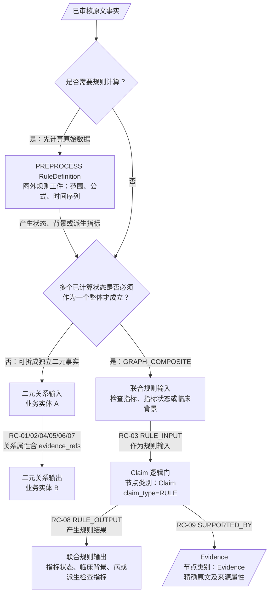

`claim_type=RULE` 的 Claim 必须至少有两个逻辑上耦合的图谱输入。规则是否拆分只由完整输入签名决定，输入签名包括输入实体、AND/OR 逻辑及直接限定该组合规则的适用条件；输出数量不作为拆分依据。完整输入签名相同时只建一个 Claim，可以通过多条 RC-08 连接一个或多个输出；多个输出是并列候选时设置 `output_semantics=CANDIDATE_SET`，不得解释为所有输出同时成立。组合逻辑写入 `subject_logic/expression_ast`。Claim 必须与来源 `RuleDefinition` 使用同一 `rule_id/version`，并保存 `required_input_count` 和 `input_signature_hash`，但不得成为另一份可独立编辑的规则真值。同一 Evidence 可以支持多个独立业务边、`RuleDefinition` 或 Claim 投影。

该结构采用成熟的二元关系与 n 元关系分治模式。Neo4j 官方建议简单上下文使用关系属性，需要表达超边或丰富共享上下文时才增加中间节点；W3C 的 n 元关系模式也只在多个参与者组成一个关系实例时引入关系类。参考：[Neo4j Modeling designs](https://neo4j.com/docs/getting-started/data-modeling/modeling-designs/)、[W3C N-ary Relations](https://www.w3.org/TR/swbp-n-aryRelations/)。

### 0.4 已确认的业务处理主线

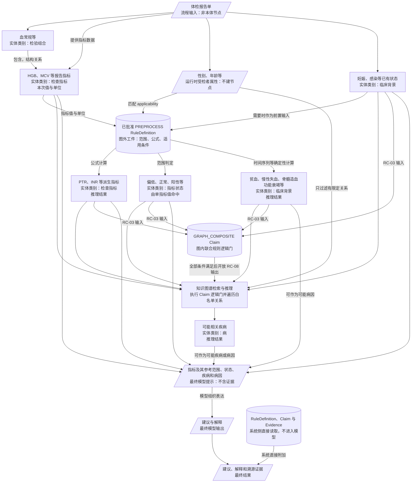

处理顺序固定为：先执行活动 `PREPROCESS RuleDefinition`，把原始报告数据变成可计算、可复用的业务状态；书本初始规则即使仍为 `review_status=PENDING` 也可活动执行，但其输出和执行轨迹必须保留审核标记。随后再把可用状态送入图谱检索，并由 `GRAPH_COMPOSITE` Claim 逻辑门完成多条件联合推理；`RULE_BOUNDARY_REVIEW_REQUIRED` 等未形成医学状态的治理结果不得进入医学推理。Claim 不重复保存前置计算逻辑，也不能绕过其来源 `RuleDefinition` 单独修改。单次请求中的原始值、受检者属性、命中状态和门激活记录均为运行时数据，请求结束后不写回静态图谱。


【技术栈】


图形约定：矩形表示本体实体，平行四边形表示流程输入、临时提示或输出数据，圆柱形表示系统直接读取的数据源。

这条主线表达的是：

1. 输入是体检报告单，其中包含检验组合、检查指标数据、性别和年龄等运行时受检者属性，以及妊娠、感染等已有【临床背景】。性别和数值年龄不建立静态图谱节点。
2. 活动 `PREPROCESS RuleDefinition` 先读取指标值、单位、已有临床背景，并使用运行时性别、年龄等属性匹配规则 `applicability`，产生【指标状态】、结果型【临床背景】或派生【检查指标】。书本初始规则可带 `review_status=PENDING` 执行；缺少必要属性时规则不得命中，也不得选择默认人群，边界歧义结果不得当作医学状态进入后续推理。
3. 图谱检索和推理随后从报告【检查指标】、计算得到的【指标状态】、已有或计算得到的【临床背景】及派生【检查指标】出发；多个状态需要共同成立时，由 `GRAPH_COMPOSITE` Claim 逻辑门校验完整输入后开放输出，再结合简单业务关系形成可能疾病和病因。病因当前是结论中的角色，可由【病】或【临床背景】承担，不预先增加“病因”实体类别。运行时性别和年龄只在某条联合规则或简单关系明确带有人群 `applicability` 时用于过滤，不参与普通图遍历。
4. 最终模型提示只包含相关【检查指标】及其适用参考范围、指标状态、临床背景、疾病和病因候选，不包含溯源证据。
5. 模型基于这些输入组织建议和解释；系统对简单边读取 `evidence_refs`，对前置计算结果从命中的 RuleDefinition.`evidence_refs` 回查，对联合规则结果沿“RC-08 `RULE_OUTPUT` → Claim → RC-09 `SUPPORTED_BY` → Evidence”回查，在模型返回后直接附加可核对的溯源证据，三条路径在最终结果处汇合。

参考范围、分类阈值、公式、时间序列算法及其适用条件保存在图外 `PREPROCESS RuleDefinition`，对应业务实体只保留可读定义和 `rule_refs`；本次值、性别、年龄和时间序列属于运行时数据。联合规则的可执行条件与版本保存在 `GRAPH_COMPOSITE RuleDefinition`，Claim 只按同一版本投影必要的逻辑门字段，并通过 RC-03 `RULE_INPUT` 和 RC-08 `RULE_OUTPUT` 表达图内输入与输出。如果人群限制只修饰一条简单医学关系，则只写在该关系的 `applicability` 中，不能与 RuleDefinition 或 Claim 重复维护。溯源文本单独进入【Evidence】，来源文档信息作为 Evidence 属性。模型提示上下文只是临时流程数据，不进入本体。

### 0.5 图示标注规则

后续图中每个具体医学节点都必须标注实体类别：

```text
[检验组合] 血常规
[检查指标] HGB
[指标状态] 血红蛋白偏低
[临床背景] 贫血
[病] 缺铁性贫血
```

医学业务节点只能使用【检验组合】【检查指标】【指标状态】【临床背景】【病】五类；联合规则逻辑门使用【Claim】，知识溯源使用【Evidence】，二者都不能充当医学推理的起点、医学结论或中间医学概念。参考范围、指标值、时间序列和方法参数在案例图中可作可读说明，但静态可执行定义写入图外 RuleDefinition，原文及来源信息写在 Evidence 属性区；只有 `GRAPH_COMPOSITE` 的投影结构写在 `claim_type=RULE` 的 Claim 属性及 RC-03/RC-08 关系中。遇到无法确定归属业务实体的对象属性时，标记“属性归属待讨论”，不新增医学实体类别。

业务推理的查询起点只能是报告中的【检查指标】、由前置规则命中的【指标状态】或已有【临床背景】，中间可经过 Claim 逻辑门推得的【指标状态】或【临床背景】，最终返回【指标状态】、【临床背景】、【病】或派生【检查指标】。案例图的第一优先级是与原文语义和全局关系方向一致，第二优先级才是竖向排版规范。在不改变语义方向的前提下，尽量将输入指标/状态放在上层，Claim 逻辑门或中间状态放在中间层，输出状态/疾病放在下层；如果排版与原文语义冲突，必须保留正确关系方向，不得为了节点位置反转边。图内联合规则数据流统一绘制为“输入实体 → RC-03 `RULE_INPUT` → Claim → RC-08 `RULE_OUTPUT` → 输出实体”；前置计算图统一把 RuleDefinition 标为“图外工件”，不使用图谱关系编号；Evidence 作为旁路溯源节点，不占用业务输入或输出层。

RC-01、RC-02、RC-04 至 RC-07 仍保留固定医学语义。所有正式案例图的边标签只使用全局目录中的“关系编号 + 英文名称 + 固定中文名称”，不把查询方向、遍历动作或案例说明写入关系名称。`CAUSES` 的固定中文名称为“导致”，机制、来源和病因分别写入 `CAUSES.relation_role`；`INDICATES` 的固定中文名称为“提示”，只承载正向支持目标的候选判断。鉴别、排除和监测等原文用途先进入候选关系的 `clinical_use`，正向或反向作用进入 `evidence_effect`，等待全部关系抽取完成后统一消歧。EC-01 到 EC-02 的 RC-01 `HAS_METRIC` 只是归属结构，不属于推理路径。

凡状态名称明确表达一个指标的取值、极性或趋势，例如“血清铁降低”“MCV 正常”“D-二聚体阳性”“MPV 持续下降”，统一归入【指标状态】。类图必须同时画出对应【检查指标】，再以 RC-02 `HAS_STATE` 指向【指标状态】，不能只画状态节点；每个【指标状态】必须且只能绑定一个明确指标。该状态若参与联合规则，再通过 RC-03 `RULE_INPUT` 指向 Claim。妊娠、慢性失血、贫血等整体临床状态，以及有独立医学含义的多指标结论归入【临床背景】；形态或时间联合条件本身由 RuleDefinition 和 Claim 逻辑门表达，不为它们额外创建“模式”中间节点，也不增加 `role/subtype` 属性。

类图中的关系统一标为“关系编号 英文关系标识（中文名称）”。英文标识、中文名称和编号均以第 0.3.2 节目录为准；案例图不得新增关系类型。图内节点声明顺序也按“输入层 → 规则/中间层 → 输出层 → 治理侧支”组织，避免渲染器把 Claim 或 Evidence 排到业务输入之前。

业务实体必须绑定连续原文片段；表格和公式实体可以绑定表头、单元格或符号组成的结构化原文位置，但只能由确定性解析器按已批准映射生成，例如把 `TIBC` 表头与 `↑` 单元格组合为“TIBC 增高”。RuleDefinition 由规则抽取与审核流程产生，Claim 和 Evidence 由已审核结果确定性投影；三者不受“医学实体名称必须逐字出现”的限制，但不得借此生成新的医学端点。遇到“胃、十二指肠溃疡出血”这类共享后缀的省略表达，当前图保留完整原文短语，不自动还原为原文未逐字出现的“胃溃疡”“消化道出血”等节点。只有这些概念在其他原文中被首次实体抽取并通过审核后，才可作为独立业务实体进入图谱。

实体 Mention 即使逐字出现在原文中，也不因此自动成为业务实体。治疗、操作等 Mention 必须按 ER-01 判断其是否参与当前检验解释：像“外科手术”这样会影响指标解释、需要医生结合考虑的概念可以归入【临床背景】；像“D-二聚体用于监测溶栓治疗”这样不参与当前报告解释流程的知识只保留在抽取记录和 Evidence 中，并标记 `OUT_OF_SCOPE`。案例图不得仅为了容纳原文 Mention 而强行入图。

各案例类图只在存在不可拆分联合规则时画 Claim/Evidence；可独立成立的二元关系不画 Claim，证据通过关系的 `evidence_refs` 回查。图中的规则 Claim 必须对应一个明确的完整输入签名，不得按输出端点数量拆分或合并规则。同一输入签名只画一个 Claim；一对多候选集使用多条 RC-08 `RULE_OUTPUT` 和 `output_semantics=CANDIDATE_SET` 表达。RC-03 只连接输入实体与 Claim，RC-08 只连接 Claim 与输出实体，不生成输入直达输出的规则投影。未重复画出的名称、别名、建议和实体证据引用等公共属性，以第 10.1 节总本体图为准。

---

## 1. 案例清单与讨论顺序

| 顺序 | 案例 | 原文难点 | 可能影响的本体构件 | 状态 |
|---|---|---|---|---|
| C1 | 标题统摄下的分层枚举 | 跨层级、例示关系、原因类别 | 【检查指标】、【指标状态】、【临床背景】、【病】、限定关系 | 已确认 |
| C2 | 指标组合、形态分类与疾病举例混写 | 判定规则与临床关联混在一句话 | 【检查指标】、【指标状态】、【临床背景】、【病】、规则结构 | 已确认 |
| C3 | 二维联合检测表 | 组合条件不能拆成单指标关系 | 【检查指标】、【指标状态】、【临床背景】、候选病因关系 | 已确认 |
| C4 | 阳性、阴性、排除、监测混写 | 极性、用途、证据强度和目标类型不同 | 【检查指标】、【指标状态】、【临床背景】、【病】、带属性关系 | 部分确认 |
| C5 | 并列成分共享谓词 | 容易错配主语，甚至生成自环 | 【临床背景】、【病】、因果关系 | 已确认 |
| C6 | 人群参考区间与严重度分层 | 人群条件、单位和边界歧义 | 【检验组合】、【检查指标】、【指标状态】、【临床背景】、PREPROCESS RuleDefinition | 已确认 |
| C7 | 多指标同步持续变化 | 时间窗口、趋势组合、提示而非诊断 | 【检查指标】、【指标状态】、【临床背景】、Claim 逻辑门 | 已确认 |
| C8 | 公式与方法参数 | 数学结构、派生指标、输入角色和方法参数 | 【检验组合】、【检查指标】、PREPROCESS RuleDefinition | 已确认 |

建议严格按 C1 至 C8 讨论。每完成一个案例，就更新第 10 节，不提前冻结最终本体。

---

## 2. 案例 C1：标题统摄下的分层枚举

### 2.1 原文

上级标题为“**血清铁**降低”  血清铁降低 ，其中一项写道：

> 2) 慢性失血：如胃、十二指肠溃疡出血，钩虫病，月经过多等。

同一列表还包含“摄入不足”“铁缺乏”“其他”等并列原因类别。

来源：`source-packages/canonical/evidence/chapter-01/chunks/0010/0000.md`

### 2.2 为什么难

标题与正文合起来实际有三层关系：

1. “血清铁”是【检查指标】，“血清铁降低”是绑定该单一指标的【指标状态】。
2. “慢性失血”与“血清铁降低”之间是原文支持的机制关系。
3. “胃、十二指肠溃疡出血、钩虫病、月经过多”是“慢性失血”的例示或具体来源。

如果只做共现关系，所有实体都会平铺连接到“血清铁”，原文的层级会丢失。如果跳过“慢性失血”直接建立“钩虫病导致血清铁降低”，又会丢失原文明确保留的中间层级。

### 2.3 候选图结构

保留中间原因类别，作为本案例唯一候选结构。

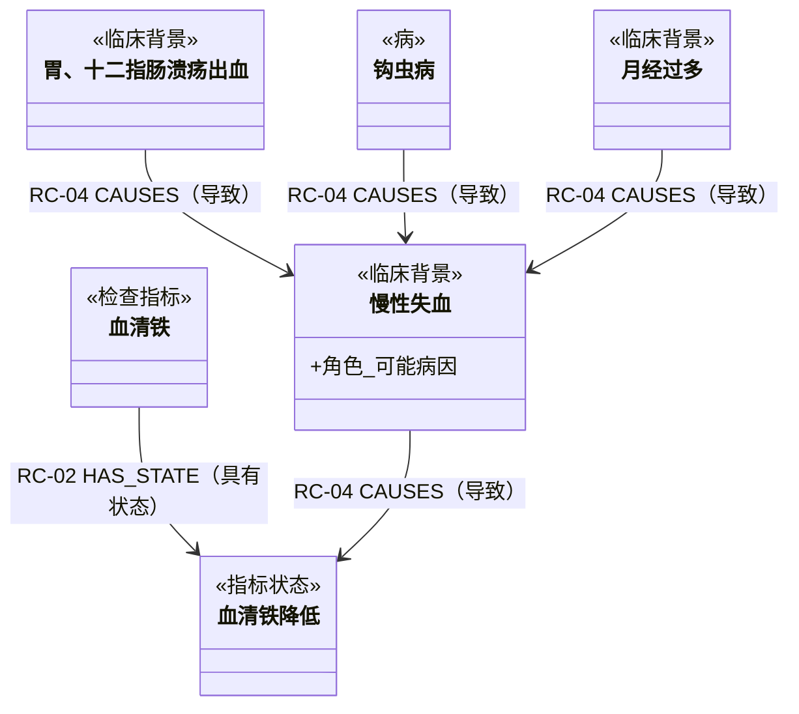

本图按原文语义绘制关系方向：“慢性失血 → 血清铁降低”，以及“胃、十二指肠溃疡出血/钩虫病/月经过多 → 慢性失血”。图中 RC-04 统一使用全局中文名称“导致”；机制、来源和病因不作为关系名称，而是分别写入 `relation_role=mechanism/source/etiology`。原文没有“可能、或许、疑似”等不确定限定，因此这些 RC-04 边均设置 `assertion_status=asserted`；这只表示原文直接陈述关系，不代表任一受检者必然存在该因果。三组关系的职责如下：

| 固定关系 | `relation_role` | 起点和终点 | 本案例含义 |
|---|---|---|---|
| RC-04 `CAUSES`（导致） | `mechanism` | 【临床背景】→【指标状态】 | 慢性失血是解释血清铁降低的机制 |
| RC-04 `CAUSES`（导致） | `source` | 【临床背景】→【临床背景】 | 胃、十二指肠溃疡出血和月经过多是慢性失血的来源；另有 `source_type=bleeding` |
| RC-04 `CAUSES`（导致） | `etiology` | 【病】→【临床背景】 | 钩虫病是慢性失血的疾病病因 |

本案例不生成跳过中间层的直接投影边。“如”只负责列举具体来源，不映射为不确定程度；其原文措辞由 Evidence 保存。

本案例中的原因分别可以作为独立二元事实成立，不存在必须共同命中的联合条件，因此不建立 Claim；各 RC-02/RC-04 关系直接保存 `evidence_refs`。

### 2.4 本案例需要讨论

- [x] 指标状态必须拆为【检查指标】血清铁和【指标状态】血清铁降低，并保留 RC-02 `HAS_STATE`。
- [x] 机制、来源和病因统一使用 RC-04 `CAUSES`，并以 `relation_role=mechanism/source/etiology` 区分；本案例原文无不确定限定，设置 `assertion_status=asserted`。
- [x] 只保留完整中间路径，不生成跳过“慢性失血”等中间状态的直接投影边。
- [x] 保留原文节点【临床背景】“胃、十二指肠溃疡出血”，不从该短语二次生成原文中未逐字出现的“胃溃疡”“十二指肠溃疡”或“消化道出血”节点。

---

## 3. 案例 C2：指标组合、形态分类与疾病举例混写

### 3.1 原文

> (4) 正细胞不均一性贫血：MCV 正常，RDW 增大，如早期缺铁性贫血、G6PD 缺乏症等。

来源：`source-packages/canonical/evidence/chapter-01/chunks/0004/0000.md`

### 3.2 为什么难

这段原文不是不能抽成规则，而是不能只抽成一条规则。它同时表达：

1. 可执行分类规则：已有“贫血”状态，且 MCV 正常、RDW 增大，则形态分类为“正细胞不均一性贫血”。
2. 非诊断性临床关联：这种形态可见于早期缺铁性贫血、G6PD 缺乏症。

若合并为一条规则，会错误得到：

```text
[指标状态] MCV正常 AND [指标状态] RDW增大 -> 诊断 [病] G6PD缺乏症
```

原文不支持这个结论。

### 3.3 候选图结构

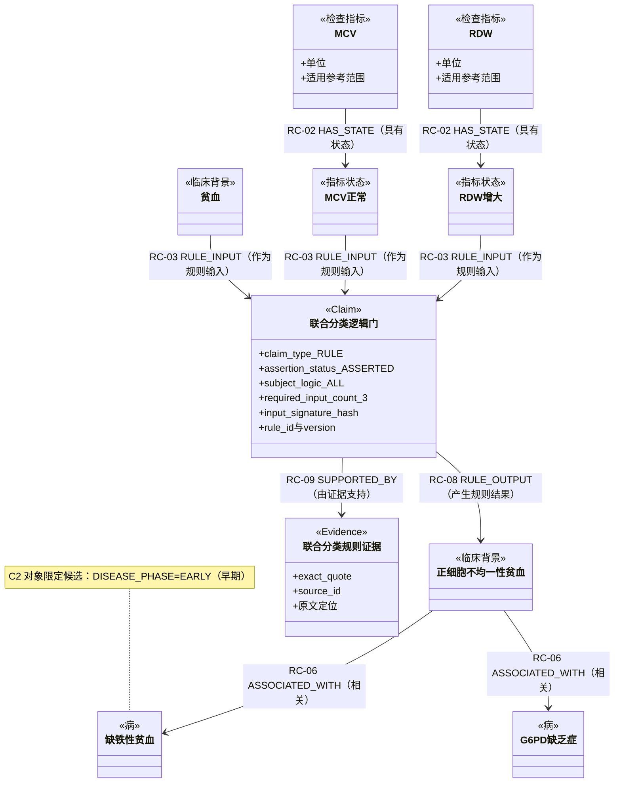

本案例采用“指标判定状态，状态参与联合规则”的两阶段结构：

1. 运行时用报告中 MCV/RDW 的值、单位与当前受检者适用的参考范围，分别判定是否命中【指标状态】“MCV 正常”和“RDW 增大”。RC-02 只定义指标可产生的状态映射，不表示任意受检者默认已命中该状态。
2. 联合分类规则的实际输入是【临床背景】“贫血”以及【指标状态】“MCV 正常”“RDW 增大”，不直接以 MCV/RDW 指标概念作为输入。三个状态必须在同一受检者、同一有效报告上下文中全部命中。

“贫血”保留为每条形态分类 Claim 的显式 RC-03 `RULE_INPUT`，不提升为规则集级别的隐藏适用条件。原文上文明确说明 MCV、RDW 用于“贫血的形态学分类”，且“贫血”是能够从当前受检者报告中判定、直接决定规则是否可以执行的临床状态；只有 MCV/RDW 的组合而未命中贫血时，不得产出贫血形态分类。这样每个 Claim 都独立包含完整触发条件，也不需要新增规则集节点、归属关系或 `applies_when` 执行层。

这个选择与原文一致：原文给出的条件已经是“MCV 正常、RDW 增大”这类解释状态，而不是具体数值阈值、公式或时间趋势。如果另一条原文明确表达“MCV < 某值”、公式计算或连续变化，才应让该规则直接关联【检查指标】及其数值条件。

其中“正细胞不均一性贫血”是规则产生的【临床背景】，不等同于最终疾病诊断。其形态分类依据已经由 Claim 的三个输入及 RC-08 输出完整表达，不再给该节点重复增加 `state_subtype=MORPHOLOGY_PATTERN`、`classification_axis` 或类似角色属性。普通节点属性本身不参与推理；只有规则引擎显式读取该属性时才会产生推理效果。当前没有按“形态模式”聚合查询或控制规则执行的明确需求，因此不增加这组抽取、校验和一致性负担；以后出现实际查询需求时再评估受控分类字段。

联合规则不生成从每个输入状态直达结果的关系，避免把单个输入误解为可以独立推出结果。已批准 `GRAPH_COMPOSITE RuleDefinition` 保存完整规则真值，并确定性投影为 `claim_type=RULE` 的 Claim 逻辑门：三条 RC-03 `RULE_INPUT` 从输入状态指向 Claim，一条 RC-08 `RULE_OUTPUT` 从 Claim 指向输出状态；`subject_logic=ALL`、`required_input_count=3`、`input_signature_hash` 与 `rule_id/version` 保证三个条件作为一个整体求值。

规则加载阶段读取已批准 RuleDefinition，并校验 Claim、RC-03 输入和 RC-08 输出与来源版本一致；患者推理阶段按完整 Claim 逻辑门执行，不把任一 RC-03/RC-08 单边当作医学语义关系遍历，RC-09 只用于溯源。未来如果出现明确的查询性能问题，可在运行时建立派生索引，但不将它作为本体关系。

两条到疾病的 RC-06 `ASSOCIATED_WITH` 只表达原文“如”所列举的一般关联，不作为疾病诊断规则执行。“如”不是不确定程度，不在关系上增加 `assertion_status`；原文措辞由 Evidence 保存。

“早期缺铁性贫血”在抽取层保留为完整 Mention，精确原文和位置进入 Evidence；本体层选择基础【病】“缺铁性贫血”，并登记 `scope=OBJECT、type=DISEASE_PHASE、value=EARLY` 的候选限定，不建立独立【病】“早期缺铁性贫血”。该限定当前只登记为 Q-C2-01，等待全部案例完成后的全局 qualifier 合并，不在 C2 中创建 `object_phase`、`target_stage` 等案例专用属性。若后续权威术语库提供具有独立稳定编码的预协调概念，再由实体消歧流程重新评估。

只有“贫血 AND MCV 正常 AND RDW 增大”这个不可拆分的联合分类规则建立 Claim。MCV/RDW 到状态的 RC-02，以及形态模式到疾病举例的 RC-06，均为可独立成立的二元关系，直接保存 `evidence_refs`。

本案例不定义任何新关系，也不生成输入直达输出的规则投影；所有保留边映射到全局目录：

| 本案例边 | 关系大类 | 固定关系 | 必要属性 |
|---|---|---|---|
| MCV/RDW → 对应指标状态 | RG-01 结构与状态映射 | RC-02 `HAS_STATE` | 用报告值、单位和适用参考范围判定；静态边不代表本次命中 |
| 贫血、MCV 正常、RDW 增大 → 联合分类 Claim | RG-02 规则输入 | RC-03 `RULE_INPUT` | `subject_logic=ALL`、`condition_group`、输入顺序 |
| 联合分类 Claim → 正细胞不均一性贫血 | RG-05 规则输出 | RC-08 `RULE_OUTPUT` | 本规则只有一个输出 |
| 联合分类 Claim → 联合分类规则证据 | RG-06 规则溯源 | RC-09 `SUPPORTED_BY` | 精确原文片段及来源定位 |
| 正细胞不均一性贫血 → 缺铁性贫血 | RG-03 医学语义 | RC-06 `ASSOCIATED_WITH` | `evidence_refs`；登记 Q-C2-01：`OBJECT/DISEASE_PHASE/EARLY` 候选限定 |
| 正细胞不均一性贫血 → G6PD 缺乏症 | RG-03 医学语义 | RC-06 `ASSOCIATED_WITH` | `evidence_refs`；“如”的原文措辞保存在 Evidence |

### 3.4 本案例需要讨论

- [x] C2 只使用全局 RC-02、RC-03、RC-06、RC-08、RC-09，不创建案例专用关系，也不生成输入直达输出的规则投影。
- [x] 不增加“形态模式”角色属性；形态分类依据只由 Claim 的 RC-03 输入、RC-08 输出及 Evidence 表达，避免与规则结构重复。
- [x] “贫血”作为每条形态分类 Claim 的显式 RC-03 `RULE_INPUT`；不新增规则集层或隐藏的适用条件。
- [x] “如、见于、相关”不映射为程度属性；RC-06 不使用 `assertion_status` 或 `strength`，具体措辞由 Evidence 保存。
- [x] “早期缺铁性贫血”作为完整 Mention 保留；本体层选择【病】“缺铁性贫血”并登记 `OBJECT/DISEASE_PHASE/EARLY` 候选限定，不建立独立疾病节点。限定是否进入正式 schema 待全局合并。

---

## 4. 案例 C3：二维联合检测表

### 4.1 原文

> 血清铁与总铁结合力（TIBC）联合检测的临床意义见表 1-4。

表格连续原文：

> <table><tr><td>血清铁</td><td>TIBC</td><td>原因</td></tr><tr><td>↓</td><td>↑</td><td>缺铁性贫血,铁吸收不良。痔、消化性溃疡出血、月经过多引起的慢性失血。妊娠、婴幼儿生长发育需铁量增加</td></tr><tr><td>↓</td><td>↓</td><td>慢性感染、肝硬变、尿毒症、肾病综合征、恶性肿瘤</td></tr><tr><td>↑</td><td>↓</td><td>铁剂治疗过量、溶血性贫血、再生障碍性贫血、巨幼细胞贫血、地中海贫血等</td></tr></table>

便于讨论的结构化转写如下；它不替代上述连续原文和 Evidence：

| 血清铁 | TIBC | 原因举例 |
|---|---|---|
| 降低 | 增高 | 缺铁性贫血、铁吸收不良；痔、消化性溃疡出血、月经过多引起的慢性失血；妊娠、婴幼儿生长发育需铁量增加 |
| 降低 | 降低 | 慢性感染、肝硬变、尿毒症、肾病综合征、恶性肿瘤 |
| 增高 | 降低 | 铁剂治疗过量、溶血性贫血、再生障碍性贫血、巨幼细胞贫血、地中海贫血 |

来源：`source-packages/canonical/evidence/chapter-01/chunks/0012/0001.md`

### 4.2 为什么难

临床意义来自两个指标的联合状态。若分别建立“血清铁降低关联缺铁性贫血”和“TIBC 增高关联缺铁性贫血”，任何一个单项都可能错误触发完整结论。

表格的每一行同时包含：

- 一组必须共同满足的条件；
- 一个由完整输入条件组定义、可连接多个候选输出的已审核规则 Claim；
- 多个类型不同的候选原因，如疾病、吸收异常、生理需求增加、治疗暴露。

### 4.3 候选图结构

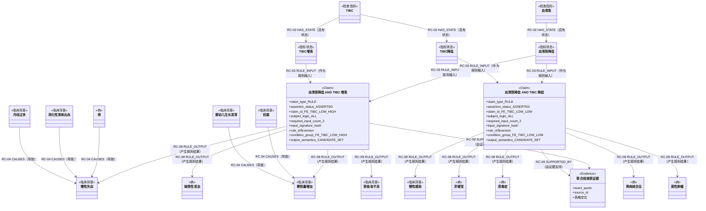

图中展开原表前两行。两行复用【指标状态】“血清铁降低”，但 TIBC 指标状态不同，因此完整输入签名不同，必须建立两个独立 Claim。每个 Claim 内的两个输入是必须共同命中的独立条件，不再合成新的复合状态：

```text
condition_group = FE_TIBC_LOW_HIGH
required_conditions = [血清铁降低, TIBC增高]
subject_logic = ALL
required_input_count = 2
input_signature_hash = sha256(规范输入签名)
output_semantics = CANDIDATE_SET
assertion_status = asserted

condition_group = FE_TIBC_LOW_LOW
required_conditions = [血清铁降低, TIBC降低]
subject_logic = ALL
required_input_count = 2
input_signature_hash = sha256(规范输入签名)
output_semantics = CANDIDATE_SET
assertion_status = asserted
```

规则拆分只看完整输入签名，不看输出数量。因此“血清铁降低 AND TIBC 增高”和“血清铁降低 AND TIBC 降低”分别抽取一条 `GRAPH_COMPOSITE RuleDefinition`，再各自投影为一个 Claim 逻辑门；每行中的多个结果通过多条 RC-08 `RULE_OUTPUT` 表示候选集，并共享该行的 `claim_id`、`rule_id/version`、`condition_group` 和 Evidence。两个 Claim 的 `assertion_status=asserted` 表示原文直接陈述这两行联合检测意义；`output_semantics=CANDIDATE_SET` 才表示各输出只是候选，二者不能混为同一程度字段。只有对应的两个 RC-03 输入状态在同一受检者、同一有效报告上下文中全部命中，且输入数量与签名一致，逻辑门才开放该行候选集；候选集不表示受检者同时确诊全部情况。本案例与 3.3 一致，不生成输入直达结果的关系。第三行因输入组合不同，后续应建立独立 RuleDefinition 和 Claim 投影。

第二行允许同一个 Claim 输出不同业务实体类型：“慢性感染”是宽泛的感染状态，归入【临床背景】；“肝硬变、尿毒症、肾病综合征、恶性肿瘤”是疾病或明确疾病分类，归入【病】。不为“慢性感染”增加状态子类型，其语义由实体名称、类型、Claim 输入和 Evidence 共同表达。若其他来源出现“慢性乙型肝炎”等具体疾病名称，则该具体概念仍归入【病】，不因其属于慢性感染而改成【临床背景】。无论输出类型如何，运行时均按 `CANDIDATE_SET` 返回为医生需要结合考虑的候选解释，不断言当前人员已经存在相应背景或疾病。

第一行的“痔、消化性溃疡出血、月经过多引起的慢性失血”保留全部原文端点：将“痔”归为【病】，“消化性溃疡出血”“月经过多”“慢性失血”归为【临床背景】，确定性展开三条指向“慢性失血”的 RC-04。疾病“痔”使用 `relation_role=etiology`，两个出血或临床状态使用 `relation_role=source`；三条关系的 `assertion_status=asserted` 并共享该表格 Evidence。联合检测 Claim 只输出“慢性失血”候选，不生成三个具体来源直达 Claim 或指标状态的边。

第一行的“妊娠、婴幼儿生长发育需铁量增加”按并列成分共享谓词处理，抽取【临床背景】“妊娠”“婴幼儿生长发育”和“需铁量增加”，再确定性展开为“妊娠 → 需铁量增加”和“婴幼儿生长发育 → 需铁量增加”两条 RC-04 `CAUSES`，均设置 `relation_role=mechanism`、`assertion_status=asserted` 并共享该表格 Evidence。联合检测 Claim 仍只把“需铁量增加”作为候选输出；检索可沿 RC-04 入边追溯妊娠或婴幼儿生长发育这两个可能背景，但不得据此断言当前人员正在妊娠或属于婴幼儿。三者均不增加状态子类型。

“婴幼儿生长发育”是原文明示、会影响检验解释的生理阶段背景，因此可以作为静态【临床背景】概念；具体受检者的数值年龄仍只作为运行时属性。运行时年龄明确不适用时，应过滤该候选；这不建立“婴幼儿”年龄节点，也不把年龄值写入静态图谱。本项复用 C5 已确认的确定性并列展开规则，满足其全部校验条件时自动批准，无需人工审核。

表格只抽取来源明确给出的行。对于“血清铁增高、TIBC 增高”等原表未列出的组合，不生成 RuleDefinition、Claim、节点、关系、覆盖占位或“书中未定义”记录；运行时未命中本表任何已抽取规则时，本表不产生输出，也不向用户追加缺省解释。来源没有写的内容不被转化为任何医学结论。

### 4.4 本案例需要讨论

- [x] 联合条件保持为两个独立【指标状态】，不产生“血清铁低TIBC高”复合实体。
- [x] C3 按完整输入签名拆分规则；4.3 已分别画出“血清铁降低 AND TIBC 增高”和“血清铁降低 AND TIBC 降低”两个 Claim，多个候选结果不用于拆分规则，也不生成输入直达输出的规则投影。
- [x] 第二行输出将宽泛状态“慢性感染”归为【临床背景】，将“肝硬变、尿毒症、肾病综合征、恶性肿瘤”归为【病】；同一个 Claim 可以输出混合实体类型，所有输出仍统一按候选集处理。
- [x] 第一行完整保留“痔、消化性溃疡出血、月经过多引起的慢性失血”，将三个来源分别以 RC-04 指向“慢性失血”；联合检测 Claim 只输出“慢性失血”候选，不建立来源直达指标状态的边。
- [x] “妊娠、婴幼儿生长发育需铁量增加”展开为【临床背景】“妊娠”“婴幼儿生长发育”“需铁量增加”，不增加状态子类型；前两者分别以 RC-04 `CAUSES` 指向“需铁量增加”，联合检测 Claim 输出“需铁量增加”候选。该共享谓词展开通过确定性校验后自动批准。
- [x] 表格缺省组合不抽取、不建模，也不显式记录“书中未定义”；来源没有写就不生成任何知识或报告输出。

---

## 5. 案例 C4：阳性、阴性、排除、监测混写

### 5.1 原文

标题：

> D-二聚体阳性见于：

正文：

> 1) 心肌梗死、脑梗死、肺栓塞、恶性肿瘤、外科手术、炎症、感染、妊娠等。
>
> 2) 继发性纤溶症（如 DIC），D-二聚体为阳性；而原发性纤溶症，D-二聚体为阴性或不升高，此检测是两者鉴别的重要指标之一。
>
> 3) D-二聚体是溶栓治疗的监测指标之一。D-二聚体正常，对排除深静脉血栓（DVT）有重要价值。

来源：`source-packages/canonical/evidence/chapter-01/chunks/0023/0000.md` 与 `0023/0001.md`

### 5.2 为什么难

- 标题与正文跨块，单独抽正文会丢失“阳性”状态。
- “阳性见于”是关联，不是充分诊断条件。
- “阴性或不升高”包含两个近似但不完全等价的状态。
- “对排除 DVT 有重要价值”表达鉴别用途，不等于逻辑上的绝对否定。
- “溶栓治疗监测”属于原文知识，但不参与当前检验报告解读的图谱检索或推理。
- 列表目标混合了疾病、手术、炎症过程、感染状态和妊娠。

### 5.3 候选图结构

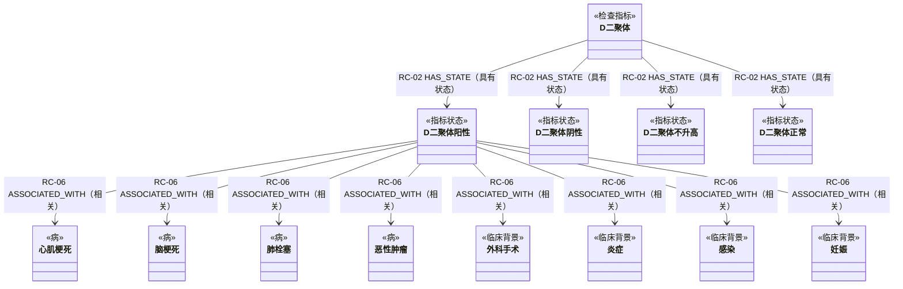

“心肌梗死、脑梗死、肺栓塞、恶性肿瘤”保留为【病】；“外科手术、炎症、感染、妊娠”归入【临床背景】。它们都是医生解释 D-二聚体阳性时需要结合考虑的疾病或临床背景，但 RC-06 只表示原文“阳性见于”的一般关联，不表示当前人员已经存在任一疾病、手术史、炎症、感染或妊娠。

“阴性”和“不升高”是两个近似但不等价的单指标状态，分别通过 RC-02 绑定 D-二聚体；二者共享同一段包含“阴性或不升高”的 Evidence，但运行时只命中报告实际支持的状态。上图绘制已经能映射到固定关系的 RC-02 状态边和“阳性见于”的 RC-06 关联边。鉴别与排除语义先保留为候选关系，不在正式案例图中提前强制映射为 RC-05：

| 候选编号 | 起点 | 终点 | `evidence_effect` | `clinical_use` | 当前处理 |
|---|---|---|---|---|---|
| CR-C4-01 | D-二聚体阴性 | 原发性纤溶症 | `SUPPORTS` | `differentiate` | 保留候选关系和 Evidence；正式关系待全局消歧 |
| CR-C4-02 | D-二聚体不升高 | 原发性纤溶症 | `SUPPORTS` | `differentiate` | 与 CR-C4-01 共享原文 Evidence；正式关系待全局消歧 |
| CR-C4-03 | D-二聚体正常 | 深静脉血栓 | `ARGUES_AGAINST` | `exclude` | 保留候选关系和 Evidence；不得按正向 RC-05 传播，也不得输出“已排除” |

“D-二聚体是溶栓治疗的监测指标之一”不建立业务节点或关系。原始 Mention 和整句 Evidence 保留，并按 ER-01 标记 `classification=OUT_OF_SCOPE`：当前报告解读既不接收治疗过程作为规则输入，也不以治疗过程作为疾病、病因或指标状态输出；全文证据检索仍可回放原文，但图谱检索、规则推理和模型提示均不消费该记录。

### 5.4 本案例需要讨论

- [x] “阳性见于”使用 RC-06 `ASSOCIATED_WITH`；不把一般关联当作充分诊断条件。
- [x] “阴性或不升高”拆成【指标状态】“D-二聚体阴性”和“D-二聚体不升高”，分别绑定同一指标并共享原文 Evidence。
- [x] 候选关系抽取分别保存 `evidence_effect` 与 `clinical_use`；正向支持和反向证据在检索、排序和推理中分流。`ARGUES_AGAINST` 不表示绝对否定，正式关系映射待全部候选关系抽取完成后统一消歧。
- [x] “溶栓治疗”不扩展为新的业务实体，也不强行归为【临床背景】；按 ER-01 标记 `OUT_OF_SCOPE`，只保留 Mention 和 Evidence。
- [x] “心肌梗死、脑梗死、肺栓塞、恶性肿瘤”归【病】；“外科手术、炎症、感染、妊娠”归【临床背景】。这些 RC-06 关联只提供医生需要考虑的候选解释，不断言当前人员已经具有对应背景。

---

## 6. 案例 C5：并列成分共享谓词

### 6.1 原文

> 造血原料缺乏所致的贫血：如铁缺乏引起的缺铁性贫血或叶酸、维生素 B12 缺乏引起的巨幼细胞贫血。

来源：`source-packages/canonical/evidence/chapter-01/chunks/0001/0000.md`

### 6.2 为什么难

“叶酸、维生素 B12 缺乏”共享“引起的巨幼细胞贫血”这一谓词。简单依存抽取容易：

- 漏掉其中一个原因；
- 错把“巨幼细胞贫血”同时当作原因和结果，形成自环；
- 把“叶酸缺乏和 B12 缺乏”误解为必须同时存在的合取条件。

### 6.3 候选图结构

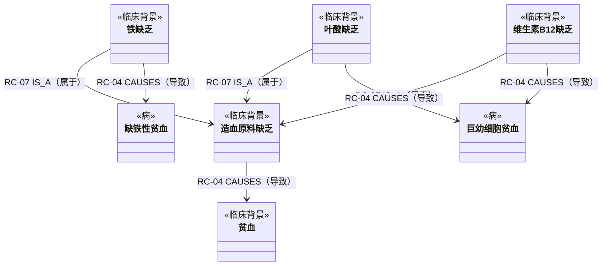

保留【临床背景】“造血原料缺乏”作为上位概念，因为它逐字出现在原文标题中，并为铁缺乏、叶酸缺乏和维生素 B12 缺乏提供医生解释贫血病因时的上位检索入口。该上位结构不替代原文明示的三条具体因果边：铁缺乏仍直接连接缺铁性贫血，叶酸缺乏和维生素 B12 缺乏仍分别直接连接巨幼细胞贫血。上位概念到【临床背景】“贫血”的 RC-04 与三条具体 RC-04 均独立保存各自的 `evidence_refs`。

本案例的完整原句作为一个 Evidence 原样保留，以上 RC-07 和 RC-04 关系可以共同引用该 Evidence。“如”只作为列举结构的抽取定位线索，最终关系仍由完整句义决定：三个具体缺乏是“造血原料缺乏”的类别成员，因此映射为 RC-07；“所致”“引起”明确表达原因到贫血结果，因此映射为 RC-04。抽取后不得用“如”或“引起”这些局部词替换完整原句。

这里三条具体因果是“任一可成立”的并列关系，不是一个必须同时满足的规则分支。

三条“引起”关系使用 RC-04 `CAUSES`，并设置 `assertion_status=asserted`：这表示原文直接陈述“引起”，不表示医学上绝对确定。精确谓词和来源由 `evidence_refs` 指向的 Evidence 保存。由于每条因果可独立成立，本案例不建立 Claim。

本例属于可自动批准的确定性并列展开：实体端点已经冻结，“引起”的关系类型和方向唯一，三条因果可以分别独立成立，且完整原文可统一回放。抽取器直接抽取“铁缺乏 → 缺铁性贫血”，并将共享谓词展开为“叶酸缺乏 → 巨幼细胞贫血”和“维生素 B12 缺乏 → 巨幼细胞贫血”；三条 RC-04 均通过确定性校验后自动批准，无需逐边人工审核。自动审核记录只保存展开器规则 ID、版本和共享 Evidence，不向知识图谱增加 Claim 或额外业务结构。

### 6.4 本案例需要讨论

- [x] 原文直接使用“引起”且无不确定限定时，RC-04 `CAUSES` 设置 `assertion_status=asserted`；不再映射为 `definite/probable`。
- [x] 保留【临床背景】“造血原料缺乏”及其 RC-07 上位分类和到“贫血”的 RC-04；同时保留三条具体缺乏到具体贫血疾病的直接 RC-04，不以上位路径替代具体对应。
- [x] “如”只是列举提示词，不固定映射关系，也不表示不确定；本句结合标题范围和完整句义确认三个具体缺乏属于“造血原料缺乏”，使用 RC-07 `IS_A`；“所致”“引起”对应 RC-04 `CAUSES`。完整原句原样保留为共享 Evidence，触发词只作抽取定位。
- [x] 可独立成立且通过全部确定性校验的并列共享谓词，自动展开并批准为多条简单关系，不进入人工审核、不建立 Claim；存在合取语义、作用域歧义、跨句补全或新端点时不适用该规则，保持 `HOLD`。

---

## 7. 案例 C6：人群参考区间与严重度分层

### 7.1 原文【性别/年龄 属性】

> 血红蛋白：男性 130～175 g/L；女性 115～150 g/L。

贫血程度表：

| 人群 | 轻度 | 中度 | 重度 | 极重度 |
|---|---|---|---|---|
| 男性 | 90～120 g/L | 60～90 g/L | 30～60 g/L | <30 g/L |
| 女性 | 90～110 g/L | 60～90 g/L | 30～60 g/L | <30 g/L |

来源：`source-packages/canonical/evidence/chapter-01/chunks/0001/0000.md`

### 7.2 为什么难

- 参考区间和贫血严重度不是同一种知识。
- 同一检验项按性别人群使用不同范围。
- “90～120”没有明确说明边界包含关系，相邻分层在 30、60、90 处表面重叠。
- 单位属于判断条件的一部分，不能只存数值。
- “男性/女性”是规则选择条件，不是疾病实体。

### 7.3 候选图结构

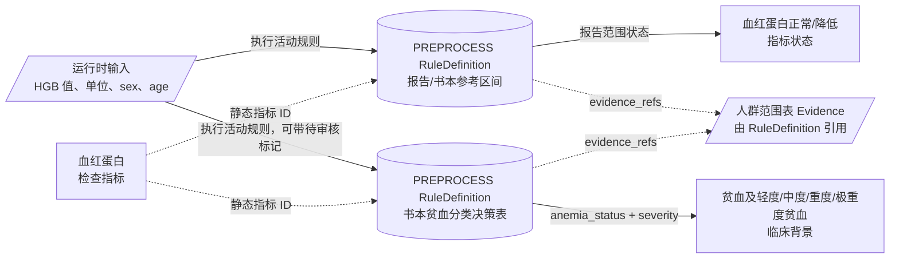

当前方案：实际指标值、单位、性别和年龄来自本次报告运行时数据；男性、女性和数值年龄不建【临床背景】节点。参考区间与贫血分类是两种不同知识，分别抽取为 `rule_stage=PREPROCESS` 的 `RuleDefinition`，各自保存 `applicability`、单位、区间及可执行 AST，并通过 `evidence_refs` 回到原表。参考区间规则输出“血红蛋白正常/降低”等【指标状态】；书本贫血分类规则使用一个互斥决策表，一次执行同时返回 `anemia_status` 和 `severity`，不拆成“先判断贫血、再判断严重度”两条串联规则。缺少性别、值或单位时不得命中，也不得默认选择任一人群。

`anemia_status` 至少区分 `ANEMIA_BY_BOOK`、`NOT_ANEMIA_BY_BOOK` 和 `RULE_BOUNDARY_REVIEW_REQUIRED`；`severity` 只在书本规则支持贫血结论时返回 `MILD`、`MODERATE`、`SEVERE` 或 `EXTREME`，其他情况为空。命中任一严重度时，运行时同时激活【临床背景】“贫血”和对应的严重度节点；静态图中以 RC-07 `IS_A` 表达“轻度/中度/重度/极重度贫血 → 贫血”，便于一般贫血规则和检索复用。`NOT_ANEMIA_BY_BOOK` 是用于阻断错误推理的运行时否定结果，不建立“无贫血”静态临床背景节点；`RULE_BOUNDARY_REVIEW_REQUIRED` 是治理结果，不进入医学图谱检索。

上述一次执行返回两个字段，不表示用严重度表代替贫血判定。`anemia_status` 是后续贫血相关规则的明确门控结果，`severity` 是在贫血成立时附加的等级；报告参考区间产生的“血红蛋白降低”不得代替 `ANEMIA_BY_BOOK`。这些都是图谱检索前的确定性计算，因此不建立 Claim，也不使用 RC-03、RC-08、RC-09。

性别和年龄条件按其限定对象单点归属：参考范围、严重度、公式等前置计算条件写入 `PREPROCESS RuleDefinition.applicability`；只有原文明示某条简单医学关系受特定人群限制时，才写入该关系的 `applicability`；只有整个联合医学规则受特定人群限制时，才随 `GRAPH_COMPOSITE RuleDefinition` 投影到 Claim.`applicability`。同一条件不得同时复制到 RuleDefinition、Claim、关系和疾病节点。RC-01 `HAS_METRIC` 是不参与推理的归属结构，为保持输入层清晰，本案例图不再重复画【检验组合】血常规及 RC-01。

多维适用条件使用稀疏决策表表达，不建立性别、年龄、妊娠、实验室或检验方法节点。每行 `applicability` 可包含 `sex`、`age_range`、`pregnancy_status`、`specimen`、`method` 和 `lab_id` 等列，但只填写原文或已审核配置明确限定的字段；字段未声明表示该规则不使用该字段选路，不等于运行时已知其值。报告自带参考区间和 `lab_id` 属于本次运行时数据，不固化进书本规则；只有某实验室另行维护并审核的配置才形成带 `lab_id` 的规则版本。

规则行按所有已声明条件的 `AND` 进行匹配。规则要求的条件在报告中缺失时返回 `INSUFFICIENT_CONTEXT`，不得选择默认人群或模糊匹配；同一输入若命中多行则返回 `RULE_SELECTION_CONFLICT`，不得依靠行顺序决定结果。发布校验应保证同一活动规则内各行在其适用空间中互斥。由此，未来增加年龄、妊娠或方法条件只增加决策表列和值，不改变图谱节点与关系结构。

书中规则是初始运行规则的主来源，不因尚待专家审核而停留在候选区。抽取器应依据书中人群、单位和数值范围生成可执行 `RuleDefinition`，发布到真实运行规则集中，并同时记录 `source_basis=BOOK`、`review_required=true`、`review_status=PENDING` 和 `boundary_status`。`review_required` 是质量治理标记，不等于 `HOLD`，也不阻止规则执行；只有结构无效、无法编译或缺少必需输入定义的规则才进入 `HOLD`。

原文未明确区间开闭、相邻区间重叠或留空时，大模型不得自行补写医学边界。初始规则仍须对所有输入给出确定的运行结果：落在无歧义区间内时按书中规则输出对应状态，并在执行轨迹中携带待审核标记；落在重叠边界或书中未覆盖区间时输出 `RULE_BOUNDARY_REVIEW_REQUIRED`，不得擅自选择某个贫血等级，同时将该规则和命中样本送入专家审核队列。这样既让书中规则进入真实运行环境，又不会把未确认的边界解释伪装成书中原意。

专家可根据临床经验和补充标准修改适用人群、单位、精确比较运算符、诊断前置条件和边界解释。修改必须形成新版本，记录审核人、修改理由、原始 Evidence 和补充依据，通过无重叠、无空档及回归校验后原子替换当前版本；书本初始版本继续保留用于追溯。发布时，同一 `rule_stage + metric_id + applicability` 只能有一个 `active` 版本，活动版本可以处于 `PENDING` 或 `APPROVED` 审核状态，不能因待审核再并行启用另一套规则。

### 7.4 本案例需要讨论

- [x] 性别和数值年龄是运行时受检者属性，不建立【临床背景】节点；参考范围和严重度的人群条件写入 `PREPROCESS RuleDefinition.applicability`，实际值从运行时 `subject` 读取，不为这类前置计算建立 Claim。仅限定简单医学关系或联合医学规则的条件才分别写在关系或 Claim 上，同一条件不重复挂载。
- [x] 多维条件使用 `RuleDefinition.applicability` 稀疏决策表表达，不建立条件节点；只声明原文或已审核配置明确要求的字段，所有已声明条件按 `AND` 匹配。缺少必需条件返回 `INSUFFICIENT_CONTEXT`，多行同时命中返回 `RULE_SELECTION_CONFLICT`；报告自带区间是运行时数据，实验室专属范围只有形成独立审核配置时才写入带 `lab_id` 的规则版本。
- [x] 以书中规则生成并发布初始可执行 `RuleDefinition`；语义不明时标记 `review_required=true`、`review_status=PENDING`，但不因此进入 `HOLD` 或停止执行。无歧义输入按书中规则计算，重叠边界或未覆盖区间返回 `RULE_BOUNDARY_REVIEW_REQUIRED` 并进入专家审核。专家修订形成新版本，通过校验后替换书本初始版本；同一运行时适用范围始终只允许一个活动版本。
- [x] 书本贫血分类使用一条互斥决策表，一次返回 `anemia_status` 和 `severity`，不拆成两条串联规则。严重度成立时同时激活【临床背景】“贫血”和具体等级，并以 RC-07 表达各严重度是“贫血”的下位概念；`NOT_ANEMIA_BY_BOOK` 仅作运行时门控结果，“血红蛋白降低”不能代替贫血判定。

---

## 8. 案例 C7：多指标同步持续变化

### 8.1 原文

> 平均血小板体积减低：见于** **，**血小板生成减少**者。MPV 随血小板数量同时持续下降，提示骨髓造血功能衰竭。

来源：`source-packages/canonical/evidence/chapter-01/chunks/0008/0001.md`

### 8.2 为什么难

“同时持续下降”不是两个静态低值，而是两条时间序列在一个观察窗口中的联合趋势。“提示”表达证据方向，不等于确诊。单次体检没有足够数据执行该判断。

### 8.3 候选图结构

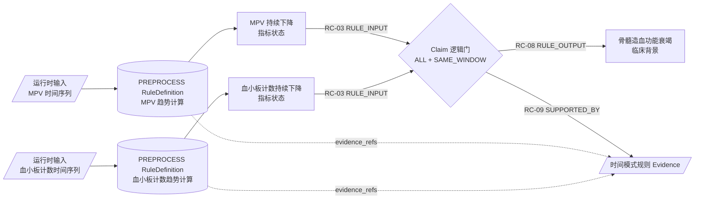

两个【检查指标】的原始时间序列属于运行时数据。两个 `PREPROCESS RuleDefinition` 分别由 Python 函数计算“MPV 持续下降”和“血小板计数持续下降”【指标状态】，每个命中状态都携带 `subject_id`、`window_id`、观测次数、单位与方法兼容结果。趋势计算不由大模型执行，也不建立 Claim。

原文中的“同时”要求两个已计算状态作为一个整体求值，因此使用 `GRAPH_COMPOSITE RuleDefinition`，并按同一 `rule_id/version` 投影为 Claim 逻辑门。两项趋势状态分别经 RC-03 输入同一个 Claim；运行时仅在 `subject_logic=ALL`、受检者一致、`temporal_join=SAME_WINDOW`、观测次数和窗口条件全部满足时，才沿 RC-08 输出“骨髓造血功能衰竭”候选。Claim 记录 `clinical_use=suggest`、`evidence_effect=SUPPORTS` 和 `output_semantics=SUPPORTIVE_CANDIDATE`，因此输出只能用于提示和候选检索，不能表述为确诊。

本案例不再建立“MPV 随血小板数量同时持续下降”组合【临床背景】节点，也不建立任一单指标趋势直达“骨髓造血功能衰竭”的 RC-05；否则单个输入可能绕过 ALL 逻辑门。时间窗、最小观测次数、缺测容忍度、方法兼容性和 `SAME_WINDOW` 等时间语义均属于 RuleDefinition/Claim 的规则条件，不写入【临床背景】的 `role/subtype`。RC-09 从 Claim 回到完整 Evidence，PREPROCESS 规则另以 `evidence_refs` 回放时间模式原文。

书中没有定义“持续下降”的最小观测次数、时间窗、缺测容忍度和方法变更处理，这些参数由专家在真实运行规则集中审核和修改。书本初始版本仍可发布为活动规则并标记 `review_required=true`、`review_status=PENDING`；只有单次数据时返回 `INSUFFICIENT_LONGITUDINAL_DATA`，存在纵向数据但必要算法参数尚未确认时返回 `RULE_PARAMETER_REVIEW_REQUIRED`，两种结果都不得激活趋势状态或 Claim。专家补齐参数后形成新版本并通过纵向回归样例替换初始版本。

### 8.4 本案例需要讨论

- [x] “持续下降”的最小观测次数、时间窗、缺测容忍度和方法兼容要求由专家在运行规则集中审核；书本初始规则带 `review_status=PENDING` 上线，参数未确认时返回 `RULE_PARAMETER_REVIEW_REQUIRED`，不由大模型猜测。
- [x] 两个单指标趋势由 PREPROCESS Python 函数分别计算，再以 RC-03 输入同一个 Claim ALL 逻辑门；Claim 同时校验同一受检者和同一时间窗，通过 RC-08 输出带 `clinical_use=suggest` 的“骨髓造血功能衰竭”候选。不建立绕过逻辑门的直接 RC-05。
- [x] 时间序列规则和 Claim 保留在正式结构中；当前只有单次体检数据时返回 `INSUFFICIENT_LONGITUDINAL_DATA`，不激活趋势状态、不打开 Claim，也不进入单次报告医学推理路径。

---

## 9. 案例 C8：公式与方法参数

### 9.1 原文

> 凝血酶原时间比值（PTR）= 受检血浆 PT（秒）/正常人血浆 PT（秒）

> INR = PTR^ISI

来源：`source-packages/canonical/evidence/chapter-01/chunks/0022/0000.md`。本架构默认进入知识抽取流程的 canonical 来源已经完成图片/OCR 统一校正，来源文本和公式正确；图片抽取质量及校正流程由独立 GitHub issue 管理，不作为本体和规则架构问题重复处理。

### 9.2 为什么难

- 公式不是普通主谓宾关系。
- 输出指标由输入指标计算得到，需要表达运算结构和单位约束。
- PTR 和 INR 的输入角色不同，且后一公式依赖前一公式的派生结果。
- ISI 是公式输入参数，只有报告提供时才能参与本次计算，不能固化成通用常数或由系统猜测补全。

### 9.3 候选图结构

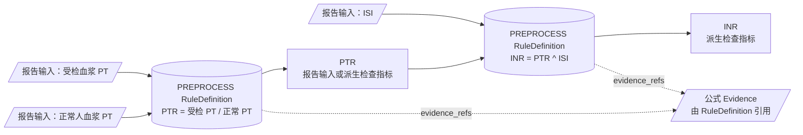

公式及其输入、输出角色抽取为 `rule_stage=PREPROCESS` 的 `RuleDefinition`，但不设计自定义 AST、MathML 或表达式 DSL。每条已发布规则绑定一个经过审核和测试的版本化 Python 函数，并保存调用契约，例如 `executor_type=PYTHON_FUNCTION`、`function_id`、`function_version`、`implementation_sha256`、必需输入、输出、单位约束和 `evidence_refs`。输出【检查指标】只保留可读定义和 `rule_refs`。运行时只按规则版本调用已注册函数，不执行大模型临时生成的代码，也不使用 `eval` 或 `exec`。简单公式候选通过函数白名单、输入输出 schema、数值边界和测试用例校验后可自动批准；结构复杂、原文有歧义或校验失败的候选保持 `HOLD`。具体实现任务及调研证据见 [GitHub Issue #7](https://github.com/xxs9331/medical-knowledge-graph-builder/issues/7)。

PTR 和 INR 按输入签名形成两个独立的计算逻辑门：

1. R1 的必需输入是报告中的“受检血浆 PT”和“正常人血浆 PT”；两项都存在、值有效且单位可换算时，才调用固定 Python 函数计算 PTR。
2. R2 的必需输入是 PTR 和报告中的 ISI；PTR 可以由报告直接提供，也可以由 R1 在本次报告上下文中派生。两项都存在且值有效时，才计算 INR。

缺少任一必需输入时只跳过对应公式，并返回 `SKIPPED_MISSING_INPUT`，不查询外部方法配置，也不由模型猜测参数。若报告同时给出 INR，且本次又满足派生条件，则分别保存 `REPORTED_INR` 与 `DERIVED_INR`，可执行一致性比较，但派生值不得覆盖报告原值。每个派生结果同时记录 `rule_id/version`、输入值引用和执行状态，以便复算和审计。

公式属于图谱检索前的确定性计算，因此不建立 Claim，也不使用 RC-03、RC-08、RC-09；公式证据由 RuleDefinition.`evidence_refs` 回放。RC-01 `HAS_METRIC` 是不参与推理的归属结构，为保持公式输入和输出层级清晰，本案例图不再重复画【检验组合】凝血功能检查及 RC-01。

### 9.4 本案例需要讨论

- [x] 公式不采用自定义 AST、MathML 或表达式 DSL；RuleDefinition 保存版本化 Python 函数引用和调用契约，运行时只执行已注册、已校验的固定函数。
- [x] 每条公式按必需输入构成独立计算逻辑门；报告满足全部输入项才计算，缺项只跳过该公式。ISI 只接受报告输入，不建立图谱节点、不固化为全局常数，也不查询外部方法配置。
- [x] 报告值与派生值并存时分别保留来源并进行可选一致性比较，派生值不得覆盖报告原值。

---

## 10. 本体合成台账

本节合成七类可用图谱节点：五类医学业务实体加【Claim】和【Evidence】。Claim 是 `GRAPH_COMPOSITE RuleDefinition` 在图中的逻辑门投影，不是每条业务边或每条计算规则的必经中间层；简单二元关系直接由业务边表达，`PREPROCESS RuleDefinition` 只作为图外抽取/执行工件。图谱不再建立独立 Rule 节点。

| 分组 | 节点类别 | 由哪个案例使用 | 主要属性 | 当前状态 |
|---|---|---|---|---|
| 业务实体 | 【检验组合】（`LabPanel`） | C6、C8 | 名称、别名、说明、实体证据引用 | 已确认 |
| 业务实体 | 【检查指标】 | C2、C3、C4、C6、C7、C8 | 名称、单位维度、可读定义、规则引用、实体证据引用；本次值和时间序列只在运行时出现 | 已确认 |
| 业务实体 | 【指标状态】 | C1、C2、C3、C4 | 绑定指标、极性/解释码、状态语义、实体证据引用 | 已确认 |
| 业务实体 | 【病】 | C1、C2、C3、C4、C5 | 病因角色、建议、实体证据引用 | 已确认 |
| 业务实体 | 【临床背景】（`ClinicalContext`） | C1-C7 | 名称、说明、建议、实体证据引用；表示影响检验解释的背景概念，不断言具体人员已具有该背景 | 已确认 |
| 规则结构 | 【Claim】 | C2、C3 等多个已计算状态联合成立的案例 | 逻辑门类型、必需输入数、输入签名哈希、输出语义、来源规则 ID/版本、审核记录 | 已确认，按需使用 |
| 知识溯源 | 【Evidence】 | 全部正式业务边和 Claim | 精确原文、来源标识、来源类型/标题/版本、文档哈希、原文位置 | 已确认 |

属性归属约定：

| 原对象内容 | 归属实体属性 | 说明 |
|---|---|---|
| 参考范围、分类范围 | `PREPROCESS RuleDefinition` | 保存人群 selector、单位、上下界、边界状态、规则版本和证据引用；【检查指标】只保存 `rule_refs` |
| 本次值、单位、时间序列 | 【检查指标】运行时属性 | 来自当前体检报告，不属于静态知识值 |
| 高、低、正常、阳性、阴性等单指标解释 | 【指标状态】.`interpretation/polarity` | 必须通过 RC-02 绑定且只绑定一个【检查指标】 |
| 方法参数、公式、时间序列算法 | `PREPROCESS RuleDefinition`；派生【检查指标】.`rule_refs/readable_definition` | 公式保存版本化 Python 函数引用及输入输出契约，时间序列算法保存固定实现与参数；指标保留可读定义和规则引用，不建立 Claim |
| 建议 | 【临床背景】或【病】.`advice[]` | 只允许来自已批准知识 |
| 实体首次抽取证据 | 五类业务实体的 `evidence_refs[]` | 引用 Evidence ID，证明实体名称来自原文 |
| 简单二元关系证据 | RC-01、RC-02、RC-04 至 RC-07.`evidence_refs[]` | 不建立 Claim，直接引用 Evidence ID |
| 联合规则证据 | Claim → RC-09 `SUPPORTED_BY` → Evidence | 从 RC-08 规则结果反向定位 Claim，再回查 Evidence |
| 联合规则唯一真值 | `GRAPH_COMPOSITE RuleDefinition` | Claim 使用同一 `rule_id/version` 确定性投影，不允许在图中独立编辑逻辑 |
| 来源文档信息 | Evidence 的 `source_*` 属性 | 不增加 Source 节点；同一出处按 `source_id` 聚合 |
| 模型提示上下文 | 不属于本体属性 | 运行时从已命中的规则输出及业务实体临时组装，排除 Claim/Evidence 正文 |

### 10.1 候选本体骨架

这张图同时展示五类业务实体、规则 Claim 和 Evidence。RC-03/RC-08 明确表达完整规则的输入与输出，Evidence 负责溯源：

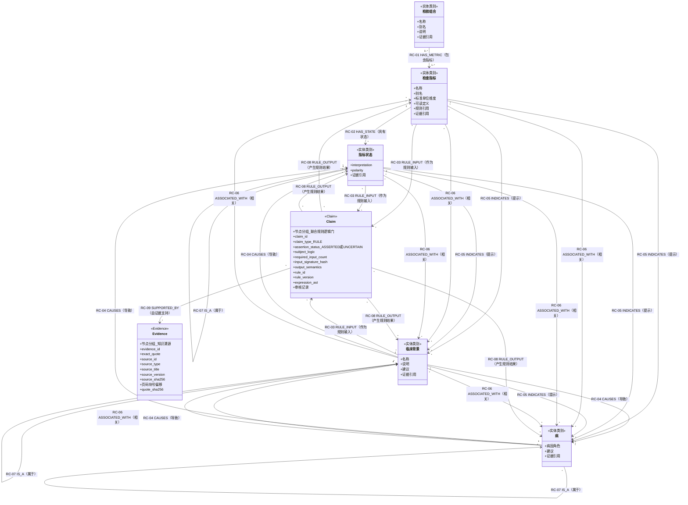

RC-01 是检查分组的归属结构；RC-02 只把检查指标连接到单指标的【指标状态】；RC-03 把检查指标、指标状态或临床背景连接到规则 Claim；RC-04 表达真实医学因果；RC-05 表达指标或状态对另一对象的提示；RC-06 只承载无法确定因果或提示方向的一般相关；RC-07 仅用于同类实体内部的上位分类；RC-08 把完整命中的 Claim 连接到派生检查指标、指标状态、临床背景或疾病候选；RC-09 连接 Claim 与原文证据。简单二元业务边本身是审核真值并直接携带 `evidence_refs`；联合规则的唯一真值是已批准 `GRAPH_COMPOSITE RuleDefinition`，Claim 只是其图内逻辑门投影，RC-03 与 RC-08 共同表达输入/输出结构，三者必须按同一 `rule_id/version` 一致生成。模型提示上下文只由已命中的业务实体和规则输出临时组装，不包含 RuleDefinition、Claim 或 Evidence 正文。

### 10.2 仍未解决的统一问题

这些问题不能在单个案例里偷偷定掉，需要跨案例比较：

1. RC-04 `CAUSES`、RC-05 `INDICATES` 与 RC-06 `ASSOCIATED_WITH` 的判定边界如何定义？候选关系的 `evidence_effect` 与 `clinical_use` 最终应成为独立关系类型还是正式关系属性？`assertion_status` 已确定只用于 RC-04 和规则 Claim。
2. 哪些 `output_semantics` 和类型的规则 Claim 允许直接产生候选【病】，哪些必须先产生【临床背景】再关联疾病？
3. 规则编译器如何以 `GRAPH_COMPOSITE RuleDefinition` 为源校验 Claim、RC-03 输入和 RC-08 输出的 ID/版本/签名，确保投影无漂移且任何单边都不会被当作完整规则执行？
4. 哪些实体和关系需要稳定 ID；结构化属性项是否也需要局部 ID 或版本号？
5. 建议作为【临床背景】或【病】的版本化属性，还是只在运行时形成？无论选择哪种，都不能由大模型脱离已批准知识自由生成。
6. 简单边的 `evidence_refs` 与复杂规则的 Claim/Evidence 分别如何回放，才能对疾病候选、可能病因和建议提供统一溯源接口？

---

## 11. 逐案决策记录

讨论时每次只更新一行，并把具体结论回填到对应案例。

| 案例 | 讨论结论 | 接受的节点/关系 | 暂缓项 | 负责人/日期 |
|---|---|---|---|---|
| B0 | 已确认：输入为体检报告单；业务实体为【检验组合】`LabPanel`、【检查指标】`LabIndicator`、【指标状态】【临床背景】【病】；“检查项”不再作为本体类别名称。`HAS_METRIC` 仅按来源明确归属建立，每个组合含 `1..*` 个指标、每个指标可属于 `0..*` 个组合，同一节点对唯一。结构化记录采用“公共外壳 + 分类载荷”，公共外壳统一标识、schema 版本、证据引用以及抽取/审核/发布状态，医学字段由对象类型决定。当前第一版代码和旧 `TestItem` 工件不作为迁移约束，文档冻结后按新合同从 canonical 来源重新抽取、验证和构图。性别、年龄等仅用于规则选择的受检者信息作为运行时属性，不建图谱节点；活动规则先计算指标状态、结果型临床背景或派生指标，再进入图谱检索和推理，其中书本初始 `PREPROCESS` 规则可带 `review_status=PENDING` 执行，边界歧义等治理结果不得作为医学状态传播；最终模型提示包含指标和适用范围但不包含证据，系统在模型返回后附加证据 | 五类业务实体、运行时受检者属性、属性归属、统一记录外壳、关系方向及第 0.4 节处理主线 | 建议的归属与版本方式 | 团队 / 2026-08-07 |
| B1 | 已确认：规则单独抽取为图外 `RuleDefinition`，作为审核、版本和执行的唯一真值；参考范围、阈值、公式、单位、方法参数和原始时间序列计算归 `PREPROCESS` 的有类型 `evaluator` 载荷，先产出指标状态、临床背景或派生指标，不建立 Claim；多个已计算业务状态必须联合成立的规则归 `GRAPH_COMPOSITE`，按同一 `rule_id/version` 确定性投影为最小 Claim 逻辑门，使用 RC-03 输入、RC-08 输出、RC-09 溯源；完整输入未满足时不得开放输出。可拆分的简单二元事实仍直接使用业务边及 `evidence_refs` | 七类图谱节点；图外 RuleDefinition；九个固定关系；RuleDefinition/Claim/Evidence 分类载荷 | 具体 JSON Schema 文件和验证器实现；非规则多元声明方案 | 团队 / 2026-08-07 |
| C1 | 已确认：指标及其状态拆成【检查指标】和【指标状态】两个节点；保留完整中间路径；因果边使用 RC-04 `CAUSES`，机制、来源和病因写入 `relation_role`；节点必须直接来自原文，不二次拆分省略表达 | 【检查指标】血清铁；【指标状态】血清铁降低；【临床背景】慢性失血、胃、十二指肠溃疡出血、月经过多；【病】钩虫病；RC-02、RC-04 | - | 团队 / 2026-08-07 |
| C2 | 已确认：正细胞不均一性贫血保留为【临床背景】，不增加形态角色属性；形态分类依据由 Claim 的输入、输出和 Evidence 表达；“贫血”是显式规则输入；“如”不映射为程度属性；“早期缺铁性贫血”保留完整 Mention，本体使用【病】缺铁性贫血并登记 `OBJECT/DISEASE_PHASE/EARLY` 候选限定，不建立独立疾病节点 | 【临床背景】贫血、正细胞不均一性贫血；【病】缺铁性贫血、G6PD 缺乏症；RC-02、RC-03、RC-06、RC-08、RC-09 | Q-C2-01 待全局 qualifier 合并；实体消歧实现见 Issue #4 | 团队 / 2026-08-07 |
| C3 | 已确认：联合条件拆成独立【指标状态】，不建立“血清铁低TIBC高”复合实体；规则按完整输入签名建立 Claim，以 RC-03 输入、RC-08 输出多个候选结果；`assertion_status=asserted` 与 `output_semantics=CANDIDATE_SET` 分别表达原文直接陈述和输出为候选集。同一 Claim 可以输出混合实体类型：宽泛状态“慢性感染”归【临床背景】，“肝硬变、尿毒症、肾病综合征、恶性肿瘤”归【病】，均不表示受检者已确诊。第一行保留“痔、消化性溃疡出血、月经过多 → 慢性失血”三条 RC-04；“妊娠、婴幼儿生长发育需铁量增加”展开为三个【临床背景】，前两者分别以 RC-04 指向“需铁量增加”。Claim 分别输出“慢性失血”和“需铁量增加”候选；不增加状态子类型，确定性展开可自动批准。表格未列出的组合不抽取、不建模、不产生报告输出 | 【指标状态】血清铁降低、TIBC 增高、TIBC 降低；【临床背景】慢性失血、消化性溃疡出血、月经过多、慢性感染、妊娠、婴幼儿生长发育、需铁量增加；【病】痔、肝硬变、尿毒症、肾病综合征、恶性肿瘤；RC-02、RC-03、RC-04、RC-08、RC-09 | - | 团队 / 2026-08-07 |
| C4 | 部分确认：单指标“阴性”和“不升高”拆成两个状态并共享原文 Evidence；候选关系分别抽取正反向 `evidence_effect` 和 `clinical_use`，反向证据不得正向传播或解释为绝对否定；“阳性见于”列表中的明确疾病归【病】，外科手术、炎症、感染、妊娠归【临床背景】并只作为医生需要考虑的候选解释；溶栓治疗监测按 ER-01 保留 Evidence 但排除出当前业务图谱 | 【检查指标】D-二聚体；【指标状态】D-二聚体阳性、阴性、不升高、正常；【病】心肌梗死、脑梗死、肺栓塞、恶性肿瘤；【临床背景】外科手术、炎症、感染、妊娠；RC-02、RC-06；CR-C4-01 至 CR-C4-03 候选关系 | 正反向候选关系的最终类型/属性消歧 | 团队 / 2026-08-07 |
| C5 | 已确认：保留【临床背景】“造血原料缺乏”作为上位概念，以 RC-07 连接铁缺乏、叶酸缺乏和维生素 B12 缺乏，并以 RC-04 连接“贫血”；上位结构不替代原文明示的三条具体缺乏到具体贫血疾病的 RC-04；“如”只作列举线索，关系由完整句义决定，完整原句由所有展开关系共享引用；可独立成立并通过确定性校验的并列共享谓词自动展开、自动批准，不建立 Claim，也不进入人工审核 | 【临床背景】造血原料缺乏、铁缺乏、叶酸缺乏、维生素 B12 缺乏、贫血；【病】缺铁性贫血、巨幼细胞贫血；RC-04、RC-07、Evidence | - | 团队 / 2026-08-07 |
| C6 | 已确认：性别和数值年龄作为运行时属性，不建【临床背景】节点；参考区间规则与书本贫血分类规则分别归图外 `PREPROCESS RuleDefinition`。贫血分类使用一条互斥决策表，一次返回 `anemia_status` 和 `severity`；严重度成立时同时激活“贫血”和具体等级，并以 RC-07 表达等级到“贫血”的上位关系，报告“血红蛋白降低”不得代替贫血判定。多维条件使用 `applicability` 稀疏列并按 `AND` 匹配，缺项和多行冲突分别返回明确治理结果。以书中规则生成并发布初始活动版本；边界不明、重叠或留空时标记 `review_required=true`、`review_status=PENDING`，无歧义输入正常计算，歧义输入进入专家队列；专家修订形成新版本并在校验后替换初始版本 | 【检查指标】血红蛋白；【指标状态】血红蛋白正常/降低；【临床背景】贫血、轻度至极重度贫血；RC-07；PREPROCESS RuleDefinition（非节点） | 专家对初始规则的运行时审核，不阻断执行 | 团队 / 2026-08-07 |
| C7 | 已确认：MPV 与血小板计数时间序列分别由 PREPROCESS Python 函数计算“持续下降”【指标状态】，状态携带受检者和时间窗签名；两个状态通过 RC-03 输入同一个 Claim ALL 逻辑门，并校验 `SAME_WINDOW` 后才经 RC-08 输出“骨髓造血功能衰竭”提示性候选。时间模式属于规则条件，不生成组合临床背景节点，也不增加 `role/subtype`；删除绕过逻辑门的直接 RC-05。规则与 Claim 保留在正式结构中，单次报告返回 `INSUFFICIENT_LONGITUDINAL_DATA`；书中未定义的趋势参数由专家审核，参数未确认时返回 `RULE_PARAMETER_REVIEW_REQUIRED` | 【检查指标】MPV、血小板计数；【指标状态】MPV 持续下降、血小板计数持续下降；【临床背景】骨髓造血功能衰竭；Claim；RC-03、RC-08、RC-09；PREPROCESS/GRAPH_COMPOSITE RuleDefinition | 专家对时间窗、最小观测次数和缺测容忍度的运行时审核，不阻断规则入库 | 团队 / 2026-08-07 |
| C8 | 已确认：公式归图外 `PREPROCESS RuleDefinition`，不建立 Claim，也不自建 AST、MathML 或表达式 DSL；规则保存版本化 Python 函数引用、实现哈希、输入输出契约和 Evidence。PTR 与 INR 分别作为两个计算逻辑门，只有报告提供对应全部输入时才执行；PTR 可由报告提供或由前序规则派生，ISI 只接受报告输入，缺项返回 `SKIPPED_MISSING_INPUT`。报告值与派生值分别保留并可做一致性比较，派生值不得覆盖报告原值。简单公式经白名单、schema、边界及测试校验后可自动批准，复杂或有歧义的公式保持 `HOLD` | 【检查指标】PTR、INR；PREPROCESS RuleDefinition（非节点）；版本化 Python 函数 | 实现与验证见 GitHub Issue #7 | 团队 / 2026-08-07 |

当 C1 至 C8 均完成后，再执行以下收口动作：

1. 合并同义构件和关系。
2. 明确节点、关系、属性、基数和唯一性约束。
3. 形成正式本体图和机器可读 schema。
4. 用八个案例反向验证本体是否无损表达原文。
5. 修订抽取合同、验证器和导入器。
6. 重跑抽取、验证、构图和 Neo4j 导入，不手工修库。

---

## 12. 本体定稿后的验证框架

本节不参与节点类型争论，但任何最终方案都必须通过这些验证。具体阈值在本体结构确定后由团队补齐。

| 层级 | 验证重点 | 失败后的处理 |
|---|---|---|
| T1 结构与序列化 | schema、JSON、SQLite、Neo4j 节点/关系、属性可解析性 | 构建失败 |
| T2 原文回放 | 每条正式知识能定位并逐字核对原文 | 保持 `HOLD` |
| T3 图谱不变量 | 无非法自环，方向、domain/range、基数和限定语正确 | 构建失败 |
| T4 规则确定性 | 边界、单位、缺项、人群、联合条件和前置依赖 | 构建失败 |
| T5 语义回归 | 正例、拒绝例、否定、并列、跨句、表格和非疾病情境 | 未达阈值不发布 |
| T6 端到端报告 | 规范化、规则命中、图谱召回、模型表达、证据旁路附加和隐私 | 不进入生产 |

### 12.1 必测不变量

- 语义关系的起点和终点不能指向同一概念。
- 每条语义关系必须有明确起点、谓词和终点；复合终点必须拆分或显式建集合。
- 所有正式入图关系必须属于 RC-01 至 RC-09；尚待全局消歧的候选关系只能保存在候选记录中，不能提前生成新的正式关系类型。案例编号、表格行、条件组和公式角色只能写入固定属性。
- 每个业务实体必须由首次实体抽取产生并回放到 Evidence；正文实体绑定连续文本片段，表格或公式实体绑定可复现的表头、单元格、符号或公式位置。规范名称只能由确定性归一化产生。RuleDefinition 只能由规则抽取与审核流程产生，Claim 和 Evidence 只能由审核结果确定性投影，不得借此补造医学实体。
- 首次实体抽取发现的 Mention 必须经过 ER-01 业务范围过滤；`OUT_OF_SCOPE` Mention 保留原文和 Evidence，但不得建立规范业务节点、可执行关系或模型提示上下文，也不得为了入图强行重标为【临床背景】。
- 静态【临床背景】节点只表示该概念与检验解释有关；除非运行时输入明确提供该背景或活动规则完整命中，否则不得把召回结果表述为当前人员已具有相应疾病史、操作史、生理或临床状态。待审核书本规则产生的有效状态必须保留规则版本和审核标记；`RULE_BOUNDARY_REVIEW_REQUIRED` 等治理结果不属于临床背景。
- 关系抽取只能引用已冻结实体目录中的节点 ID；任何包含新端点、补全省略成分或医学常识扩展节点的模型输出必须拒绝或进入人工复核，不能直接入图。
- 候选关系必须分别保存 `evidence_effect` 和 `clinical_use`；`SUPPORTS` 与 `ARGUES_AGAINST` 在检索、排序和推理中必须分流，任何反向证据都不得沿正向提示路径传播，也不得直接推出目标疾病不存在。
- RC-01、RC-02、RC-04 至 RC-07 的简单二元边必须携带有效 `evidence_refs`；RC-03 必须从允许的输入实体指向 Claim，RC-08 必须从 Claim 指向允许的输出实体。不得生成输入直达输出的规则投影，也不得为了统一形式给所有业务边强制增加 Claim。
- 每个 Claim 至少通过一条 RC-09 `SUPPORTED_BY` 指向 Evidence；Evidence 必须包含稳定 `source_id`、文档版本或哈希、原文定位和逐字摘录。
- `claim_type=RULE` 必须来源于已批准 `GRAPH_COMPOSITE RuleDefinition`，至少有两个逻辑耦合的图谱输入，并且至少有一条 RC-03 输入和一条 RC-08 输出；参考范围、阈值、公式、单位换算和原始时间序列计算必须归 `PREPROCESS`，不得仅为入图而建立 Claim。多个候选输出必须声明 `output_semantics=CANDIDATE_SET`。
- 患者推理必须按 Claim 逻辑门整体求值：`subject_logic=ALL` 时满足 `required_inputs ⊆ matched_inputs` 且输入数量一致后，才能读取其 RC-08 输出；`ANY` 或嵌套逻辑按受限 AST 求值。禁止把单条 `RULE_INPUT`、单条 `RULE_OUTPUT` 或 RC-09 `SUPPORTED_BY` 纳入医学路径传播。图算法投影必须使用显式关系白名单。
- 名称明确包含单一指标取值、极性或趋势的节点必须归为【指标状态】，并且恰有一条来自对应【检查指标】的 RC-02 `HAS_STATE`；不得归为【临床背景】，也不得成为孤立状态节点。
- 原文以“或”连接两个近似但不等价的单指标状态时，应分别建立状态节点并共享 Evidence；不得为简化图结构合并成运行时无法精确命中的复合状态。
- 【临床背景】不得仅因名称中出现指标词就自动拆为【指标状态】；形态或时间联合条件本身不生成【临床背景】模式节点，也不增加 `role/subtype`，而由 RuleDefinition 和 Claim 逻辑门表达。只有联合规则输出的独立医学结论才可归入【临床背景】。单指标状态直接从原始数值或时间序列计算时由 `PREPROCESS RuleDefinition` 产生；多状态联合结论由 Claim 逻辑门产生。
- 业务推理查询必须从报告【检查指标】、命中的【指标状态】或已有【临床背景】出发，最终返回【指标状态】、病症或派生【检查指标】；病症只能由【病】或结果型【临床背景】承载。`CAUSES` 必须保持“原因 → 结果”的医学方向，追因查询通过反向遍历入边实现，不能为了匹配查询方向而颠倒边义。
- 多指标结论的所有 RC-03 输入必须指向同一个 `claim_type=RULE` 的 Claim；缺少任一必需输入时不得沿该 Claim 的 RC-08 产生结果。
- 规则 Claim 必须有 `rule_id/version`、`required_input_count`、`input_signature_hash`、输出语义、适用条件和必要的逻辑门结构；RC-03/RC-08 的端点必须与来源 RuleDefinition 一致，禁止在图中独立修改。
- 原文未定义的边界、单位换算、时间窗和证据强度不能由模型自行补齐。
- candidate、批准方式（确定性自动批准或人工审核）、发布和执行授权不能共用一个状态字段。
- 不得维护 `RuleDefinition`、Claim 和输入直达输出规则边三套可独立编辑的真值；唯一规则真值是已批准 RuleDefinition。Claim、RC-03、RC-08 和 RC-09 都是 `GRAPH_COMPOSITE` 规则的确定性图投影，不生成输入直达输出的规则边。
- Neo4j 只接受可复现工件导入，不接受库内手工热修作为最终修复。
- 请求结束后不得持久化报告正文、原图、指标值、患者属性或运行时状态。

### 12.2 大模型自查的职责

大模型只生成结构化疑点，不能修改图谱或批准知识。至少检查：

- 关系两端是否都引用首次实体抽取形成的已有节点 ID，是否出现模型二次生成的新节点；
- 主语与结论是否自指、颠倒或遗漏条件；
- 并列项是否错误解释为 `AND`，共享谓词是否漏展开；
- “正常排除”“可能见于”“提示”“导致”“定义为”的极性和语气是否被改变；
- 结论究竟是疾病、病因、生理状态、操作、治疗暴露还是参数；
- 二维表是否被错误拆成单指标到疾病的直达边；
- 同一事实在别名归一后是否重复或冲突。

建议每条疑点至少返回：`record_id`、`finding_type`、原文摘录、原因、建议动作、置信度。建议动作只能是 `HOLD`、`SPLIT`、`RETYPE`、`REEXTRACT` 或 `HUMAN_REVIEW`。

### 12.3 验收仍需讨论

- [ ] 第一批人工 gold set 覆盖哪些案例，每类多少条？
- [ ] 各关系类型的 precision/recall 门槛是多少？
- [ ] 哪些问题由确定性校验直接拒绝，哪些必须人工判断？
- [ ] 每次重建需保留哪些差异报告、规则版本、模型版本和审核记录？

---

## 13. 当前问题如何转成回归案例

以下是 2026-08-06 讨论稿所依据的当前工件/Neo4j 快照。它们用于验证新方案是否解决真实问题，不用于反推“孤立率越低，本体越好”。进入实施前应重新跑一次统计，确认快照没有漂移。

### 13.1 孤立概念

- 当时业务图有 641 个节点；旧实现标签 `MedicalConcept` 有 365 个，其中 251 个没有语义关系。
- 这些孤立概念主要来自高召回实体抽取。
- C1、C2、C4、C5 用来判断哪些孤立节点确有原文关系可补，哪些只应保持 mentioned-only/candidate 状态。
- 质量目标不是把孤立率降到零，而是避免无依据连接，并提高有明确关系原文的召回率。

### 13.2 自指 Claim

当时发现 7 条主语和结论指向同一节点的 Claim：

1. 叶酸缺乏导致巨幼细胞贫血；
2. 中晚期缺乏叶酸导致早产；
3. 中晚期缺乏叶酸导致出生低体重；
4. 中晚期缺乏叶酸导致胎儿宫内发育迟缓；
5. INR 是口服抗凝药监测指标；
6. 全血黏度高切升高直接原因；
7. 红细胞变形能力异常主要见于。

C5 直接覆盖并列主语/宾语错配问题；C4 和 C8 覆盖“监测指标”及公式附近的语义边界。最终回归必须证明这 7 条错误在抽取端被修复或拦截，而不是只在 Neo4j 删除。

### 13.3 已有规则不是空白

- HGB + 性别人群的贫血状态/程度规则已经存在，C6 讨论的是它应如何规范表达和处理边界。
- MCV + RDW 的贫血形态规则已经存在，C2 讨论的是如何把分类结果与疾病举例拆开。
- 血清铁 + TIBC 联合规则已经存在，C3 讨论的是如何把每个联合分支展开成具体模式和候选原因。

因此后续实现应优先迁移和修正现有规则，不应重新假设这些领域“尚无规则”。

---

## 附件 A：规则 Claim 的输入/输出关系方案与外部依据

> 调研日期：2026-08-07。团队已选择方案 B；第 0.3.2 节、总本体图和各案例图已按该方案统一更新。

### A.1 调研问题

当 Claim 从纯治理节点转为可执行的规则/推理节点后，需要决定：

1. 是否继续使用一个 `CLAIM_PARTICIPANT` 并通过 `role=input/output` 区分角色；
2. 是否拆成两个显式关系 `RULE_INPUT` 和 `RULE_OUTPUT`；
3. 是否为了减少关系数量，合并为一个项目自定义的 `RULE_FLOW`；
4. `CAUSES` 能否同时表示医学因果和规则推导。

### A.2 成熟规范和官方模式

| 来源 | 核心模式 | 对本项目的启示 |
|---|---|---|
| [W3C SWRL Member Submission](https://www.w3.org/submissions/SWRL/) | 一条规则明确分为 `_body` 和 `_head`；两者都是 atom 列表 | 条件与结论是两个不同角色，不建议用无角色的单一关系混合 |
| [W3C RIF Primer](https://www.w3.org/TR/rif-primer/) | 规则使用 `If A Then B`，明确分离 antecedent 和 consequent | 完整输入条件组对应 If/body，输出对应 Then/head；规则节点应保留这个边界 |
| [W3C PROV-O](https://www.w3.org/TR/prov-o/) | `prov:Activity` 使用 `prov:used` 表达输入，用 `prov:generated`/`prov:wasGeneratedBy` 表达输出 | 对具有输入和输出的中间执行节点，成熟模式倾向使用两个语义不同的谓词 |
| [W3C N-ary Relations](https://www.w3.org/TR/swbp-n-aryRelations/) | RDF/OWL 的属性是二元关系；多个参与者共享关系属性时，可引入关系实例类 | 将联合规则建成 Claim 中间节点是成熟的 n 元关系模式 |
| [Neo4j Modeling designs](https://neo4j.com/docs/getting-started/data-modeling/modeling-designs/) | Neo4j 不直接支持连接多个节点的 hyperedge，官方建议用 intermediary node 表达共享上下文 | Claim 节点可以保存条件组、版本、逻辑、置信度和证据等共享信息 |
| [W3C SHACL Advanced Features](https://www.w3.org/TR/shacl-af/) | SHACL rules 使用 `sh:condition` 表达执行条件，规则命中后生成推导 RDF triples | 规则条件与生成结果应分开表达，且推导结果不等于医学因果 |

### A.2.1 “Claim 逻辑门”的成熟性核查

核查结论：**底层方案成熟，“逻辑门”是本项目的沟通术语，不是 W3C 或 Neo4j 定义的正式节点类型。** 它由两个已有成熟模式组合而来：形式规则中的前件/后件及 AND/OR 求值，和属性图中的中间节点/n 元关系建模。

| 本项目说法 | 成熟对应 | 结论 |
|---|---|---|
| Claim 的 RC-03 输入和 RC-08 输出 | [W3C RIF-BLD](https://www.w3.org/TR/rif-bld/) 的 premise/conclusion；[SWRL](https://www.w3.org/submissions/SWRL/) 的 body/head | 输入条件与输出结论分侧表达是成熟规则结构 |
| `subject_logic=ALL/ANY` | RIF-BLD 的 `And(...)`/`Or(...)`；其中 AND 只有全部子条件为真才为真 | “只有三个条件全部满足才开放输出”具有正式逻辑对应 |
| 多个输入共享一条规则及其版本、证据和输出语义 | [W3C N-ary Relations](https://www.w3.org/TR/swbp-n-aryRelations/) 的关系实例；[Neo4j intermediary node](https://neo4j.com/docs/getting-started/data-modeling/modeling-designs/) | 用 Claim 中间节点承载多参与者共享上下文是成熟图建模方式 |
| 条件满足后产生新状态 | [W3C SHACL Advanced Features](https://www.w3.org/TR/shacl-af/) 的 `sh:condition` 与 inferred triples | 规则产出应与原始断言区分，且规则推导不等于医学因果 |
| Neo4j 中校验全部/任一输入 | [Cypher `all()`/`any()`](https://neo4j.com/docs/cypher-manual/current/functions/predicate/) | 可实现 ALL/ANY 门，但普通路径遍历不会自动获得规则语义 |

成熟边界也需要写清：Neo4j 的中间节点只解决“怎么存”，不会自动执行 AND/OR；Claim 必须由查询层或独立规则执行器求值。Cypher `all()` 对空列表返回 `true`，因此 ALL 门必须同时校验 `required_input_count > 0`、实际收集数量和 `input_signature_hash`，不能只调用 `all()`。`RuleDefinition → Claim` 的确定性投影和 `PREPROCESS/GRAPH_COMPOSITE` 两阶段划分是本项目的工程治理方案，不是上述标准强制规定；其可靠性取决于版本一致性校验、拒绝缺项和回归测试。

据此，本项目可以继续使用“Claim 逻辑门”作为架构简称，但 schema 和实现文档必须使用正式字段说明其语义，不能让开发者误以为 Neo4j 节点本身具备门电路或规则引擎能力。

### A.3 候选方案对比

| 方案 | 结构 | 优点 | 主要风险 | 与成熟模式的一致性 |
|---|---|---|---|---|
| A. 参与关系 + `role` | 输入/输出都用 `CLAIM_PARTICIPANT`，通过 `role` 区分 | 关系类型少，可同时表达 RULE 和 NARY_RELATION | 查询必须始终过滤 `role`；缺失或写错 `role` 会破坏方向语义 | 符合 n 元关系中间节点思路，但输入/输出谓词不够显式 |
| B. 显式输入/输出关系 | 输入 → `RULE_INPUT` → Claim → `RULE_OUTPUT` → 输出 | 结构自解释，domain/range 和查询约束清晰，不依赖 `role` 才能区分两侧 | 比单关系方案多一个关系类型 | 与 SWRL body/head、RIF If/Then、PROV-O used/generated 最一致 |
| C. 单一 `RULE_FLOW` | 输入 → `RULE_FLOW` → Claim → `RULE_FLOW` → 输出 | 图形简单，关系数量最少 | 同一谓词在 Claim 两侧承担不同语义；依赖节点方向或 `role`；非规则 Claim 难复用 | 是项目自定义压缩方案，未在本次检索的 W3C/Neo4j 官方模式中找到直接对应 |
| D. Body/Head 子节点 | Claim → Body/Head → 条件/结果 atom | 最贴近形式规则语言，容易表达嵌套 AND/OR | 节点和边增幅大，查询路径长，对当前案例过重 | 与 SWRL/RIF 最接近，但不符合当前“图谱尽量简单”的业务目标 |

### A.4 已确认方案

已确认选择方案 B，且不增加总关系数量：

1. 将现有 RC-03 `RULE_INPUT_FOR` 改为“【检查指标】/【指标状态】/【临床背景】 → Claim”的 `RULE_INPUT`（作为规则输入），不再建立输入直达业务输出的投影边。
2. 将现有 RC-08 `CLAIM_PARTICIPANT` 改为“Claim → 【检查指标】/【指标状态】/【临床背景】/【病】”的 `RULE_OUTPUT`（产生规则结果）。
3. 保留 RC-09 `SUPPORTED_BY`（由证据支持）连接 Claim 和 Evidence。
4. 保留 RC-04 `CAUSES`（导致）为纯医学因果关系，不用它表示规则命中或计算产出。
5. 规则拆分仍只看完整输入签名；同一输入签名只建一个 Claim，输出数量不导致拆分。候选输出集需明确设置 `output_semantics=CANDIDATE_SET`。

该方案将现有两个关系类型重定义，因此固定关系总数仍为 9，不需要额外增加第 10 个关系。方案 C `RULE_FLOW` 不采用，因为它依赖方向或 `role` 才能区分输入和输出，语义清晰度低于方案 B。

### A.5 决策结果与剩余问题

- [x] 选择方案 B：RC-03 `RULE_INPUT` + RC-08 `RULE_OUTPUT`。
- [x] 本轮 Claim 只承载 `claim_type=RULE`；非规则多元声明延后设计，不保留 `CLAIM_PARTICIPANT`。
- [x] `output_semantics=CANDIDATE_SET` 已足以表达输出为候选集；RC-08 不携带程度属性。Claim 的 `assertion_status` 只描述原文是否带不确定措辞，不能与候选输出语义混用。

---

## 附件 B：指标状态与临床背景的拆分依据

> 调研日期：2026-08-07。团队已确认将【指标状态】从【临床背景】中拆出，作为第五类医学业务实体。以下标准用于说明语义边界；具体图结构是本项目为支持规则检索所作的工程映射。

### B.1 外部标准中的边界

| 来源 | 标准中的处理方式 | 对本项目的启示 |
|---|---|---|
| [HL7 FHIR Observation](https://hl7.org/fhir/R4/observation.html) | Observation 表达测量和时间点观察；规范明确说明诊断通常应由 Condition 表达 | 单指标结果与临床诊断/问题不应混为同一类对象 |
| [HL7 FHIR Observation.interpretation](https://hl7.org/fhir/R4/observation-definitions.html) | `interpretation` 是对观察值的分类解释，典型值包括 high、low、normal | “MCV 正常”“血清铁降低”“D-二聚体阳性”对应指标结果解释，不是普通临床背景 |
| [HL7 FHIR Condition](https://hl7.org/fhir/R5/condition.html) | Condition 表达疾病、问题、诊断或需要关注和管理的健康状态 | 贫血、慢性失血等整体临床状态与单指标解释应分开 |
| [HL7 FHIR Observation.context（R6 ballot）](https://build.fhir.org/observation-definitions.html) | `Observation.context` 表达理解观察值或解释所需的上下文信息；当前仍是 ballot 版本 | 本项目用 `ClinicalContext` 表示影响检验解释的背景概念，但不把静态概念误写成具体人员事实 |
| [SNOMED CT Clinical Finding and Disorder](https://docs.snomed.org/snomed-ct-specifications/snomed-ct-editorial-guide/readme/authoring/domain-specific-modeling/clinical-finding-and-disorder) | 区分 Observable entity、Clinical finding 与 Disorder；可测量对象不等同于患者发现或疾病 | 【检查指标】、【指标状态】、【临床背景】和【病】需要明确语义边界 |
| [OMOP CDM](https://ohdsi.github.io/CommonDataModel/cdm53.html) | 标准化检验结果进入 Measurement；体征、症状和诊断进入 Condition Occurrence；其他事实进入 Observation | 检验解释、整体临床状态和疾病应按用途分域，不能只靠名称判断 |

### B.2 本项目映射

| 本项目实体 | 标准概念映射 | 判定规则 |
|---|---|---|
| 【检查指标】 | Observable/Measurement definition | 可观察或可计算的指标，如 MCV、RDW、血清铁 |
| 【指标状态】 | Observation interpretation 的图谱化表达 | 仅描述一个指标的高、低、正常、阳性、阴性或单指标趋势，必须通过 RC-02 绑定一个指标 |
| 【临床背景】 | Interpretation context / clinical context / composite state | 可能影响检验解释或需要医生结合考虑的生理、临床、既往操作或治疗背景，以及联合规则输出的独立医学结论；不要求绑定单一指标，也不表示具体人员已具有该背景；联合条件本身、仅用于规则选择的性别和数值年龄不建节点 |
| 【病】 | Condition/Disorder/Diagnosis | 明确疾病或疾病分类 |

FHIR 等标准通常把 high、low、normal 作为 Observation 的字段，而不是独立资源。本项目把它们建成【指标状态】节点，是因为已审核规则需要直接引用“MCV 正常”“TIBC 增高”等条件并连接 Claim；这是面向规则检索的确定性重述，不表示标准要求必须建立独立节点。

### B.3 已确认约束

- [x] 五类医学业务实体为【检验组合】`LabPanel`、【检查指标】`LabIndicator`、【指标状态】【临床背景】【病】；“检查项”不作为本体类别名称。
- [x] 每个【指标状态】必须且只能通过一条 RC-02 `HAS_STATE` 绑定一个【检查指标】。
- [x] 单指标的高、低、正常、阳性、阴性和单指标趋势归【指标状态】。
- [x] 多指标形态或时间联合条件由 RuleDefinition 与 Claim 逻辑门表达，不建立模式【临床背景】节点，不增加 `role/subtype`；只有最终独立医学结论才归【临床背景】。
- [x] 【临床背景】使用机器名 `ClinicalContext`；它是从医学知识抽取的解释背景概念，不是患者实例或已确认病史。
- [x] RC-03 `RULE_INPUT` 和 RC-08 `RULE_OUTPUT` 同时允许【指标状态】，关系类型总数仍为 9。
